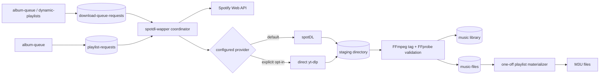

# `spotdl-wapper`: current state

This document describes the integrated implementation in the repository as of
2026-07-28. It is an as-built reference, not a description of the pre-migration
wrapper.

The repository and Compose service retain the historical name
`spotdl-wapper`. Some log labels use `spotdl-wrapper`.

## Executive summary

`spotdl-wapper` is now a long-running, provider-neutral acquisition worker. It
atomically claims MongoDB jobs, resolves Spotify objects to track metadata,
acquires each track through one explicitly configured provider, validates and
tags the result, publishes it into the library, and synchronously upserts the
`music-files` catalog.

Two acquisition providers are integrated:

- `spotdl` is the default compatibility and rollback backend;
- direct `yt-dlp` is an explicit opt-in backend with wrapper-owned candidate
  search and conservative matching.

There is no automatic provider fallback. A process constructs exactly one
provider. The first successful claim atomically pins an unassigned request to
that provider, and retries/reclaims remain pinned to it. Two differently
configured workers can therefore coexist without cross-provider retry drift,
but whichever worker wins an unassigned request determines its backend. There
is no producer cohort-routing or operator re-route API yet.

The previous one-shot lifecycle, bulk spotDL branch, post-download indexer
handshake, and catalog-lag-as-download-failure behavior are no longer part of
the active download path. Legacy models and some unused indexer methods remain
for compatibility.

## System context



There is no HTTP endpoint on the worker. Producers write MongoDB documents,
and the process polls for eligible work. `album-queue` now treats the worker as
the lifecycle owner: rendering the queue may calculate a local progress
snapshot, but it does not mark a request complete.

`dynamic-playlists` still has a separate subscribed/dynamic playlist workflow
and its own M3U generation. One-off `playlist-requests` remain in this worker.

## Runtime lifecycle

The process lifecycle is defined by
[`main.go`](../spotdl-wapper/main.go) and
[`service.go`](../spotdl-wapper/pkg/service/service.go):

1. Validate configuration before constructing the logger.
2. Create a signal-aware context for `SIGINT` and `SIGTERM`.
3. Create the Spotify client, connect to and ping MongoDB, and attempt index
   creation.
4. Construct exactly one acquisition provider plus the shared importer.
5. Before each processing pass, remove expired private provider-attempt
   directories from staging.
6. Immediately drain currently eligible download work.
7. Process active one-off playlist requests.
8. Wait for the poll ticker and repeat.
9. On shutdown, cancel in-flight work, release an interrupted claim when
   possible, close MongoDB, stop Loki delivery, and flush the logger.

`SLEEP_IN_MINUTES` is now only a legacy throttle between claimed download
requests in one drain. It does not delay the first request. Work created while
playlist processing is running is picked up by the next poll.

`WORKER_POLL_INTERVAL` is the cadence of a ticker created before the first
processing pass, not a guaranteed delay after a pass completes. If a pass runs
longer than the interval, a queued tick can make the next pass start
immediately. Download work is drained before playlists on every pass, so a
continuously replenished download queue can starve one-off playlist work.

Downloader and FFmpeg/FFprobe commands receive a context and a timeout. They
are executed with direct argument arrays rather than a shell. On Linux and
Darwin, cancellation targets the subprocess process group so child FFmpeg
processes do not outlive the worker. Captured diagnostics are bounded before
being attached to errors.

Compose still uses `restart: unless-stopped`, but restart is no longer the
polling mechanism. There is no worker health or readiness endpoint.

## Download workflow

Download processing is implemented in
[`download_requests.go`](../spotdl-wapper/pkg/service/download_requests.go).
Every Spotify track, album, or playlist request follows the same per-track
pipeline.

### Claim and metadata resolution

The worker claims one eligible document with MongoDB `FindOneAndUpdate`. The
claim sets:

- `state=claimed`;
- `worker_id`;
- a cryptographically random `claim_id`;
- `lease_expires_at`;
- `backend` to the configured provider, assigning it when previously empty;
- `active=true`.

Selection preserves the legacy preference for non-errored work, then sorts by
`created_at` and `_id`. Legacy active documents with missing/empty state are
treated as pending. An expired lease makes an unfinished job reclaimable.
The claim filter accepts only an empty backend or the worker's configured
backend. First claim therefore creates durable provider affinity, and a retry
or lease reclaim cannot silently move to the other provider. Assignment of a
previously unassigned request is still nondeterministic when differently
configured workers race for it.

Once processing starts, the worker renews the lease every one-third of
`WORKER_LEASE_DURATION`, clamped to an interval between one and 30 seconds.
Configuration rejects lease durations below three seconds.
Every owner mutation requires the same worker ID, the current random claim ID,
and an unexpired lease. The claim ID fences a stale processing attempt even if
the same worker ID later reclaims the document. If renewal fails, the worker
cancels the command/import context and stops acting as the owner.

If `track_metadata` is absent, the worker resolves the Spotify URL and persists
canonical metadata for each usable track:

- Spotify URL and ID;
- normalized artist, title, and album;
- ISRC when supplied by Spotify;
- duration, explicit flag, and detected version marker;
- per-track progress and acquisition provenance fields.

Null, local, unplayable, empty-ID, or non-track playlist items are filtered
out, and `expected_track_count` is set to the usable metadata count. Track,
album, and playlist URLs are supported by the metadata expansion path.
Although the URL parser recognizes artist URLs, acquisition of an artist URL
is not supported.

Before acquiring anything, the worker prechecks the catalog by Spotify ID,
then ISRC, then a case-insensitive artist/title fallback only for legacy
records that have neither stable identity. A match counts only when its path is
a readable, non-empty regular file contained within the library root; if the
catalog has a checksum, the on-disk checksum must also match. Invalid or stale
catalog rows do not cause the track to be skipped.

### Per-track acquisition

For each track not already found, the worker:

1. transitions the request to `resolving`;
2. asks the configured provider for acceptable candidates;
3. chooses the first candidate returned by that provider;
4. transitions to `downloading` and acquires a staged file;
5. transitions to `validating` and invokes the shared importer;
6. records the published path/checksum and provenance as an `imported` recovery
   journal before catalog mutation;
7. explicitly renews the lease and upserts the returned `MusicFile`;
8. marks the track found, stores the returned catalog ID, and persists the
   cataloged checkpoint.

Progress is persisted after every successful import. If a later track fails,
earlier imports stay cataloged and marked found; a retry skips them. The request
is `completed` only when every usable track is found. If catalog upsert fails
after the recovery journal, a retry revalidates that exact published
path/checksum and resumes cataloging without resolving, downloading, or tagging
the track again.

The request-level `result` contains the most recently imported artifact.
Multi-track provenance is therefore authoritative in `track_metadata[]`, not
in the single request-level result. While a journaled catalog upsert is pending,
the result has the published path/checksum but no catalog ID.

### spotDL compatibility provider

The default provider is implemented in
[`spotdl.go`](../spotdl-wapper/pkg/acquisition/spotdl.go).

Resolution returns the canonical Spotify track URL as one synthetic,
score-`0`/unscored candidate. spotDL still owns its internal media-source
lookup and matching, so the wrapper cannot report confidence comparable to a
direct yt-dlp score or identify spotDL's actual media source.

Each acquisition uses a private attempt directory beneath staging:

```text
<ACQUISITION_STAGING_PATH>/.harmoniq-attempt-<spotify-or-derived-id>-<random>/
  <spotify-or-derived-id>.<format>
```

The command receives an output template ending in `{output-ext}` and the
adapter verifies the expected configured-format result:

```text
spotdl <spotify-track-url> \
  --output <private-attempt-path>/<safe-id>.{output-ext} \
  --format <ACQUISITION_AUDIO_FORMAT> \
  [--config] \
  --no-cache
```

`SPOTDL_USE_CONFIG=true` adds spotDL's boolean `--config` flag. spotDL discovers
the file in its standard config locations; no config pathname is passed to the
CLI. There is no bulk request branch and no `--sync-without-deleting`
behavior.

### Direct yt-dlp provider

The direct provider in
[`ytdlp.go`](../spotdl-wapper/pkg/acquisition/ytdlp.go) is used only when
`ACQUISITION_BACKEND=yt-dlp`.

Resolution runs a bounded `ytsearchN` query built from artists, title, version,
and `audio`, then parses `--dump-single-json --flat-playlist` output. Candidates
are scored with:

| Signal | Weight |
| --- | ---: |
| Title token coverage | 60% |
| Artist token coverage | 20% |
| Duration similarity | 15% |
| Version-marker agreement | 5% |

Candidates are hard-rejected when title similarity is below `0.75`, artist
similarity is below `0.5`, known durations differ by more than 30 seconds, or a
strict variant is unexpectedly present or missing. Strict variants are live,
remix, cover/tribute/karaoke, nightcore, slowed, and sped-up. Acoustic,
instrumental, remaster, demo, and edit markers affect the score but are not
hard rejections.

Remaining candidates below `YTDLP_MINIMUM_SCORE` are dropped and the
highest-scoring candidate is selected. No acceptable candidate produces
`needs_review`; the worker does not silently fall back to spotDL.

Acquisition requests audio extraction, reads the final path from yt-dlp's
`after_move:filepath` machine output, and confines the result to a private
attempt directory under staging. It returns a structured provider/source
result. Search reasons exist on the in-memory candidate but are not currently
stored in MongoDB.

Both providers support only `mp3`, `flac`, `ogg`, `opus`, `m4a`, and `wav`.
For yt-dlp, `ogg` selects its `vorbis` audio format. A configured
`YTDLP_MINIMUM_SCORE=0` is honored; hard rejection rules still apply.

> **Authorized content only:** direct yt-dlp acquisition must only be used for
> content the operator is permitted to download. This implementation choice
> does not grant rights to third-party media or override service terms.

## Validation, tagging, and import

The shared importer is implemented in
[`importer.go`](../spotdl-wapper/pkg/library/importer.go). It is the authority
for converting a provider result into a catalog item:

1. Require the provider path to be a non-empty regular, non-symlink file in a
   marked private attempt directory directly beneath
   `ACQUISITION_STAGING_PATH`; validate resolved containment and verify the
   provider-supplied checksum when present.
2. Expand `MEDIA_OUTPUT_TEMPLATE` and reject a final path outside
   `MUSIC_LIBRARY_PATH`. Staging and library roots must differ, and the media
   template cannot point into staging.
3. Run FFmpeg into a temporary file beside the final destination, stream-copying
   the selected audio and adding canonical title, artist, album, ISRC, Spotify
   ID, and source/Spotify URL metadata. Embedded artwork is also preserved for
   `mp3`, `flac`, and `m4a`; other configured formats omit video streams.
   Bit-exact muxing flags make repeated tagging checksum-stable, including OGG
   and Opus containers.
4. Run FFprobe and require a readable audio stream and positive duration.
5. Enforce a duration tolerance equal to the larger of the configured
   tolerance and 5% of the expected Spotify duration.
6. Calculate the final tagged-file SHA-256 checksum, set mode `0640`, and sync
   the temporary file.
7. Try deterministic destination candidates: the desired path, an
   identity-suffixed path, a short-checksum path, and a full-checksum path.
   Identical existing content is reused; exhausting distinct collision
   candidates sends the request to review.
8. Publish with an atomic hard-link operation, sync the destination directory
   for a new file, and remove the staged source only after the final path
   exists.
9. Return a canonical `MusicFile`; the coordinator journals it, renews its
   lease, upserts `music-files`, and uses the stored catalog document's ID in
   the request result.

Supported final-template placeholders are `{artists}`, `{artist}`, `{title}`,
`{album}`, `{spotify-id}`, and `{output-ext}`. Metadata components are
sanitized, and the fully expanded result must remain inside the library root.
Oversized filename and directory components are UTF-8-safely truncated with a
deterministic hash suffix; filenames reserve headroom for collision suffixes
and remain below filesystem component-length limits.

The importer provides atomic visibility of a completed file, but MongoDB and
the filesystem are not one transaction. The recovery journal closes the normal
catalog-failure window. A process/host crash in the smaller interval after
publication but before the journal write can still leave an uncataloged file
until reacquisition or external reconciliation.

After acquisition, a failure before the importer successfully consumes the
asset invokes its discard path. Discard repeats marked ownership, resolved
containment, and no-symlink validation before removing the staged file and its
now-empty attempt directory. Once import succeeds, the source has already been
consumed. The worker journals the published artifact next; subsequent catalog
failures resume from it, while failure before that journal is durable leaves
the small reconciliation boundary described above. Before every processing
pass, staging cleanup removes marked `.harmoniq-attempt-*` directories older
than twice the larger of
`ACQUISITION_COMMAND_TIMEOUT` and `WORKER_LEASE_DURATION`. It intentionally
does not delete direct files or symlinks in staging. This cleanup addresses
abandoned provider attempts, not the publish-before-journal window in the final
library.

## Durable request states

The shared model is
[`DownloadQueueRequest`](../models/download_request.go).

| State | Meaning | Automatically claimable |
| --- | --- | --- |
| `pending` | New producer-created work | Yes |
| `claimed` | Owned under a lease | After lease expiry |
| `resolving` | Metadata or candidate resolution | After lease expiry |
| `downloading` | Provider command in progress | After lease expiry |
| `validating` | Import validation/tagging in progress | After lease expiry |
| `imported` | A published artifact is journaled; its catalog upsert may be pending or complete | After lease expiry |
| `completed` | Every usable track is found | No |
| `retry_wait` | Retryable error scheduled for `next_attempt_at` | At/after schedule |
| `needs_review` | Non-retryable ambiguity or operator action required | No |
| `failed` | Retry budget exhausted | No |
| `cancelled` | Explicitly cancelled | No |

`completed`, `failed`, and `cancelled` are model-terminal. `needs_review` is
operationally paused even though it is not reported as terminal by
`IsTerminal`; there is no built-in review/resume UI yet.

The worker dual-writes legacy flags:

- active processing states use `active=true, errored=false`;
- `retry_wait` and `needs_review` use `active=true, errored=true`;
- `completed` uses `active=false, errored=false`;
- `failed` uses `active=false, errored=true`;
- `cancelled` uses `active=false, errored=false`.

This keeps older readers usable while making `state` authoritative.

### Retry classification

Each claim increments `sync_count`. Retryable metadata, resolution, download,
and pre-publication import failures increment `retry_count`; after
`WORKER_MAX_ATTEMPTS`, the request becomes `failed`. Otherwise it enters
`retry_wait` until `WORKER_RETRY_DELAY` has passed.

Catalog-finalization failures after publication are deliberately different.
The recovery journal preserves the exact path/checksum, so journal persistence,
lease renewal, catalog upsert, or catalog-result persistence failures enter
`retry_wait` with the same backoff without incrementing `retry_count`. They can
therefore continue beyond `WORKER_MAX_ATTEMPTS` rather than strand a valid
published artifact.

Spotify errors receive special handling:

- `429` is retryable; the direct playlist-items request honors `Retry-After`
  when it is longer than the configured delay;
- `401` and `403` move to `needs_review`;
- `400` and `404` move to `needs_review`;
- `5xx` errors retry;
- other classified `4xx` errors require review.

Errors returned by the Spotify SDK are normalized to the same status-carrying
API error type, so status classification applies consistently, but the SDK
error does not expose `Retry-After`. No acceptable candidate, legacy skipped
tracks, missing canonical track URLs, invalid assets, unsafe output paths,
provider-checksum mismatches, publish collisions, and duration mismatches also
require review. Provider execution and pre-publication persistence errors are
retryable and budget-consuming; published-artifact catalog finalization is
retryable but preserves the budget. Cancellation schedules immediate retry
without consuming the retry budget.

The current attempt budget is request-wide rather than independently budgeted
per metadata, resolution, download, and validation stage. Catalog finalization
is excluded from that budget as described above.

## MongoDB contracts and indexes

### `download-queue-requests`

The collection stores request identity, legacy flags, explicit state, owner,
random claim fence and lease, retry schedule, pinned backend, typed
`last_error`, the most recent structured result, aggregate progress, and
canonical per-track metadata/provenance.

New requests created by `album-queue`, `dynamic-playlists`, or playlist
materialization start in `pending`. Duplicate suppression treats pending,
in-flight, retrying, review, and completed stateful requests as already synced.
Failed and cancelled requests may be intentionally submitted again. Legacy
documents remain subject to legacy active/success flags.

### `music-files`

Newly imported records include normalized display metadata plus Spotify
ID/URL, ISRC, duration, source provider/ID, match score, checksum, format,
canonical path, provenance metadata, and timestamps.

For an upsert, the database filter uses the first non-empty input identity:
Spotify ID, otherwise ISRC, otherwise path. It does not query each identity in
sequence. The operation returns the stored document, including its catalog ID.
Startup attempts to create a sparse unique index on Spotify ID and sparse
non-unique index on checksum. Duplicate checksums are valid because identical
content can be referenced by more than one catalog record; ISRC and path are
not currently unique or separately indexed here.

### `playlist-requests`

This remains a legacy boolean/counter queue: URL, creator, `active`, `errored`,
`retry_count`, and `no_pull`. It does not yet use the download queue's atomic
claim, lease, typed errors, or explicit states.

### `index-status`

The model and database methods remain, as does the unused
`IndexDownloadedFiles` implementation, but the active download and one-off
playlist flows no longer read or write `index-status`. Synchronous importer
catalog upsert replaced the indexer gate for worker-acquired files.

Index creation is best effort. Duplicate legacy Spotify IDs can prevent the
unique index from being created without preventing startup; operators must
inspect the warning and clean the data before retrying index creation.

## One-off playlist behavior

One-off processing is implemented in
[`playlist_requests.go`](../spotdl-wapper/pkg/service/playlist_requests.go):

1. Read active `playlist-requests`.
2. Defer a playlist while a download request for the same Spotify playlist URL
   remains active.
3. Fetch the current playlist name and items from Spotify.
4. Resolve catalog paths by case-insensitive exact artist/title matching,
   including a first-artist fallback.
5. If the catalog is empty, treat every usable playlist track as missing.
6. Unless `no_pull` is set, enqueue individual pending track requests not
   already represented by in-flight, review, or successful history.
7. If any track remains missing and `no_pull` is false, leave the playlist
   active and do not write a partial M3U, whether or not this pass created new
   work.
8. When nothing is missing, or when `no_pull` explicitly allows omission,
   write an M3U from the catalog paths currently available.

Playlist filenames are sanitized and length-limited. The M3U helper creates the
parent directory, rejects line injection, requires each entry to be an existing
regular non-symlink file, and enforces containment against the resolved library
root even through parent-directory symlinks. It flushes a temporary file,
atomically replaces the playlist, and syncs the playlist output directory.

An empty `no_pull` playlist produces a valid empty M3U. Waiting for missing
files is expected coordination: it does not set `errored`, increment
`retry_count`, or deactivate the playlist. Other errors increment the legacy
retry counter and deactivate the request after five failed passes.

Waiting can be indefinite. Duplicate suppression treats some existing
download-request histories, including review or successful records, as already
represented. If such a request has no usable catalog file, the playlist
neither creates a replacement request nor completes. One-off playlist requests
also have no claim or lease.

## Spotify integration

The shared Spotify adapter supports an optional `SPOTIFY_REFRESH_TOKEN`:

- with a refresh token, it creates a user OAuth token source;
- without one, it retains client-credentials authentication for non-user
  metadata and Extended Quota deployments.

Playlist contents use the current paginated
`GET /v1/playlists/{id}/items` response and its `item` field. A first-page 404
under client credentials falls back to the legacy client route for
compatibility. Local, null, empty-ID, non-track, and explicitly unplayable
items are excluded. Errors from the Spotify SDK are normalized into the
worker's status-carrying API error. The direct playlist-items request also
preserves `Retry-After` and Spotify's reason field; those fields are not
available from the SDK's error type.

Spotify Development Mode playlist reads require user authorization and are
limited by Spotify's current ownership/collaboration rules. The repository
accepts a refresh token but does not implement the interactive authorization
flow that obtains one. There is no application-level metadata cache; quota
control currently relies on request scheduling and retry classification. See
Spotify's
[February 2026 migration guide](https://developer.spotify.com/documentation/web-api/tutorials/february-2026-migration-guide)
and [API changelog](https://developer.spotify.com/documentation/web-api/references/changes/february-2026).

## Configuration and container

The complete setting reference is in
[`configuration.md`](./configuration.md). Important operational distinctions
are:

- `MEDIA_OUTPUT_TEMPLATE` controls final media paths;
- `PLAYLISTS_OUTPUT_PATH` controls M3U placement;
- `ACQUISITION_STAGING_PATH` contains provider output;
- `DESTINATION` is only a deprecated media-template alias;
- `WORKER_POLL_INTERVAL` controls ticker cadence;
- `SLEEP_IN_MINUTES` only throttles requests within a drain.

The container runs as non-root UID 10001. The mounted music library must allow
that user to create staging, media, and playlist files. Compose defaults the
spotDL configuration host path to `./.spotdl`, mounts it at both spotDL's
current and temporary legacy locations, and leaves Loki delivery disabled by
default.

The Dockerfile currently pins:

| Component | Version |
| --- | --- |
| Go builder | 1.23.4 |
| Python runtime | 3.13.14 |
| Deno | 2.9.4 |
| spotDL | 4.5.2 |
| yt-dlp | 2026.7.4 |
| yt-dlp-ejs | 0.8.0 |

The image runs `pip check` and downloader version checks during the build.
These are version pins, not fully reproducible image digests or a complete
transitive lock: Debian packages, base-image contents, and Python transitive
resolution can still change.

Startup logging uses a non-secret allowlist and does not serialize credentials,
MongoDB/Loki URLs, or refresh tokens. Console logs are debug-level; optional
Loki delivery starts at info-level.

## Remaining limitations and migration hazards

1. **Direct yt-dlp is an operator/legal choice.** It is not an official Spotify
   download path and must be restricted to authorized content.
2. **spotDL remains a black-box matcher.** The compatibility provider reports a
   synthetic unscored value of `0`; the wrapper cannot review spotDL's selected
   source before acquisition.
3. **Direct matching is conservative but incomplete.** Explicit/clean edition,
   recording identity, regional alternatives, and source quality are not
   scored. Candidate reasons are not persisted, and there is no review UI.
4. **Backend affinity lacks controlled routing.** First claim is durably pinned
   and retries cannot drift, but an unassigned request goes to whichever
   provider worker claims it first. Producers cannot select a cohort, and there
   is no audited re-route operation. Removing a provider's workers leaves its
   pinned unfinished jobs unclaimable by the other backend.
5. **Identity behavior is not uniform.** Download prechecks prefer Spotify ID
   and ISRC and validate the file, but the catalog upsert filter selects only
   the first non-empty input identity. Playlist materialization still matches
   artist/title and can conflate editions or miss differently normalized
   historical records.
6. **Filesystem and MongoDB are not transactional.** A crash between publish
   and the recovery-journal write can still leave an uncataloged final file or
   require reacquisition. Journaled catalog failures resume without
   reacquisition, but staging-attempt cleanup does not reconcile the remaining
   final-library crash boundary.
7. **Validation has no quality policy.** FFprobe requires an audio stream and
   duration agreement, but there is no codec allowlist, bitrate floor,
   loudness policy, artwork requirement, or explicit tag-schema version.
8. **One-off playlist jobs retain legacy coordination.** They have no claim or
   lease. Missing files no longer consume their error budget or produce a
   partial non-`no_pull` M3U, but dependency history without a usable catalog
   file can leave them active forever. A continuously replenished download
   queue can also starve playlist processing.
9. **Playlist ownership is duplicated.** `spotdl-wapper` owns one-off requests
   while `dynamic-playlists` separately owns subscribed/dynamic materialization.
10. **External files still need reconciliation.** Synchronous catalog upsert
    covers worker imports only; there is no tracked scanner in the supported
    stack for files added outside this pipeline.
11. **Best-effort indexes require operational follow-up.** Legacy duplicates
    can leave the unique Spotify-ID index unenforced apart from a startup
    warning. Checksum is deliberately non-unique; ISRC and path also have no
    uniqueness constraint.
12. **Operational visibility is log-only.** There are no queue-depth,
    lease-age, latency, wrong-match/review-rate, or import metrics and no worker
    health endpoint.
13. **Some legacy code remains.** Index-status methods, the unused indexer
    launcher, old database methods, and test-only M3U scanning structures
    should be removed only after compatibility consumers are audited.

## Tests and verification surface

The wrapper now has unit/contract coverage for:

- provider selection, spotDL/yt-dlp commands, machine-output parsing,
  cancellation on Linux and Darwin, diagnostics, and candidate scoring;
- importer path safety, provider-checksum verification, duration validation,
  canonical metadata, deterministic muxing, bounded components, final
  checksums, collision/idempotency behavior, publication, discard, and
  ownership-marked orphan-attempt cleanup;
- atomic claims, random claim fencing, backend affinity, lease ownership,
  legacy eligibility, state dual-writing, duplicate suppression, and catalog
  identity;
- request completion, no-candidate review, retry exhaustion, Spotify
  `Retry-After`, stable-identity catalog prechecks, invalid-catalog-file
  rejection, imported recovery journaling, and catalog-resume behavior;
- empty-catalog/no-pull and missing-file wait behavior, safe filenames,
  symlink-safe contained M3U entries, and durable atomic replacement;
- configuration defaults and validation;
- the current Spotify `/items` response, local/unplayable item filtering, SDK
  error normalization, and error classification.

The remaining test gap is a container-level, real-MongoDB and real-tool
end-to-end test covering request creation through final M3U output. Production
rollout should also use a curated audio matching corpus; unit tests cannot
measure real wrong-match rates.

The migration history and operational rollout/rollback plan are documented in
[`spotdl-wapper-migration.md`](./spotdl-wapper-migration.md).
