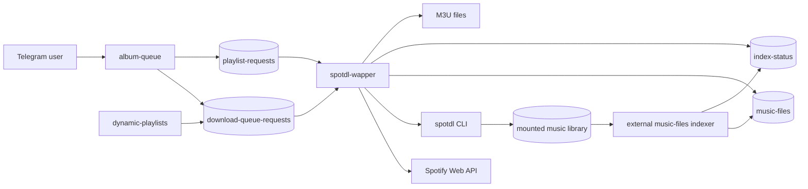

# `spotdl-wapper`: current state

This document describes the component as it exists today. It is intentionally
an as-is reference, not a proposal for its replacement.

Snapshot reviewed on 2026-07-27 on branch `easy-start` at commit
`a1a761943bec35adb75ac7b57570417b671db728`.

The repository and Compose service use the name `spotdl-wapper`. Some log labels
use `spotdl-wrapper`; this document uses the repository name.

## Role in the system

`spotdl-wapper` is a one-shot Go worker around the `spotdl` command-line
program. It does considerably more than launch the downloader:

- reads download and playlist work from MongoDB;
- expands Spotify albums and playlists into track metadata;
- invokes `spotdl` for bulk or per-track downloads;
- tracks request, retry, and per-track progress;
- reconciles downloaded tracks against the `music-files` collection;
- coordinates with an external filesystem indexer through `index-status`;
- creates M3U files for one-off playlist requests;
- writes console logs and can also ship them to Loki.

The actual audio lookup, download, conversion, and tag writing are delegated to
`spotdl`, `yt-dlp`, and FFmpeg.

## System context



There is no HTTP or RPC call into the worker. Producers insert MongoDB
documents, and the worker discovers them on its next pass.

### Producers and competing state owners

- `album-queue` is the primary producer. It normally resolves the Spotify
  object name, type, expected count, and track metadata before inserting a
  request. Its `/queue` read path also reconciles against `music-files` and can
  mark a request inactive, so the worker is not the only completion writer.
- `dynamic-playlists` creates one-track download requests for missing
  subscribed-playlist entries. It also owns a second M3U implementation.
- `spotdl-wapper` creates more one-track requests while processing legacy
  `playlist-requests`. Because downloads run before playlist requests, those
  new jobs wait for the next container restart.

The `album-queue` webhook does not wake this worker. It is a plain HTTP GET, and
the example configuration points it at `album-queue`'s own health endpoint.

### Downstream consumers

The migration surface extends beyond the three core services:

- `album-queue` displays and mutates queue progress and failure state;
- `dynamic-playlists` reads `music-files` paths and inactive request history;
- experimental `album-normalizer`, playlist composers, and `deduplicator`
  consume the indexed catalog, tags, files, or generated M3Us.

Changing tags, filesystem layout, `MusicFile.Path`, or the meaning of inactive
queue history therefore requires a compatibility or data-migration plan.

## Process lifecycle

The lifecycle is defined by
[`main.go`](../spotdl-wapper/main.go) and
[`service.go`](../spotdl-wapper/pkg/service/service.go):

1. Load required environment variables.
2. Build the console/Loki logger.
3. Construct the shared Spotify metadata client.
4. Connect a MongoDB client.
5. Process all active download requests sequentially.
6. Process all active one-off playlist requests sequentially.
7. Return from the processing pass, wait five seconds, and exit.

The worker does not contain a polling loop. In the supported Compose setup,
`restart: unless-stopped` restarts the successfully exited container, which
turns repeated process launches into polling. Running the binary directly
performs one pass only.

The Compose service has no health check or readiness endpoint. Graceful signal
handling and MongoDB disconnection are also not implemented.

## Download processing

Download processing is implemented in
[`download_requests.go`](../spotdl-wapper/pkg/service/download_requests.go).

### Request selection and ordering

The worker loads every document where `active` is `true`, sorts non-errored
requests before errored requests and then by `created_at`, and handles them one
at a time. It sleeps for `SLEEP_IN_MINUTES` before every request, including the
first request in a pass.

Requests are read and later updated in separate operations. There is no atomic
claim, lease, or worker identity, so more than one worker can process the same
request.

### Metadata expansion

If a request has no expected count or track metadata, the worker calls the
shared Spotify service to populate them. The same service determines whether a
URL refers to a track, album, playlist, or artist.

The persisted per-track identity consists of:

- Spotify URL;
- normalized artist string;
- normalized title;
- `found`, `skipped`, and `failed_attempts` progress fields.

ISRC, duration, album identity, source candidate, and final filesystem path are
not persisted in the queue document.

### Downloader branches

Playlist requests with track metadata are pre-checked against `music-files` and
downloaded one track at a time. Other requests, including albums and individual
tracks, use one bulk command.

The current bulk invocation is equivalent to:

```text
spotdl <spotify-url> \
  --output <DESTINATION> \
  --config \
  --no-cache \
  --sync-without-deleting
```

The current per-track invocation omits `--sync-without-deleting`:

```text
spotdl <spotify-track-url> \
  --output <DESTINATION> \
  --config \
  --no-cache
```

Despite comments in the source referring to `spotdl --sync`, neither command
passes the `sync` operation.

Standard output and standard error are scanned line by line and written as
structured log messages. The worker uses `exec.Command`, not
`exec.CommandContext`, so request cancellation does not stop the subprocess and
there is no per-download timeout. Linux builds set a parent-death signal so the
child is killed if the worker process itself dies.

### Completion semantics

A zero exit status from `spotdl` is not sufficient to mark a track as found.
The worker queries `music-files` and performs a case-insensitive exact match on
artist and title. This makes the external indexer part of the download
completion path.

A request is deactivated when either:

- every track is `found` or `skipped`; or
- `sync_count` reaches three.

For playlist downloads, a failed subprocess increments a track's failed-attempt
count, and the final catalog reconciliation can increment it again while the
file is still absent from `music-files`. A track is skipped after three failed
attempts. Individual track failures are logged but are not returned as a
request-level error by the playlist branch.

The result is an at-most-three-pass policy, not an assurance that every
requested track was downloaded.

## Indexing handshake

The worker reads and writes a singleton-like document in `index-status`:

- after processing downloads, it sets `last_updated` to the current time;
- playlist processing is deferred while `last_updated > last_indexed`;
- an external indexer is expected to scan the filesystem, populate
  `music-files`, and advance `last_indexed`.

The tracked repository does not contain or run that indexer. A local
`music-files-indexer` directory may appear in a developer checkout, but the root
`.gitignore` pattern `**/*-indexer` ignores the directory and all of its
contents. It is absent from `go.work`, the root Makefile, CI, and
`docker-compose.yml`.

There is no initialization/upsert path for `index-status`; a clean database
without a status document causes both the post-download status update and
playlist gate to fail.

`IndexDownloadedFiles` in
[`indexation.go`](../spotdl-wapper/pkg/service/indexation.go) is unused and does
not provide the missing integration.

## One-off playlist processing

One-off M3U requests are implemented in
[`playlist_requests.go`](../spotdl-wapper/pkg/service/playlist_requests.go):

1. Wait for the index-status handshake to indicate indexing is caught up.
2. Fetch the current Spotify playlist name and tracks.
3. Match tracks against `music-files`.
4. Unless `no_pull` is set, enqueue a download request for each missing track.
5. Return a retryable `missing files` error if new download work was created.
6. Create an M3U from the paths currently present in the catalog.
7. Deactivate the playlist request on success or after five failed passes.

`DESTINATION` has two incompatible uses:

- it is passed to `spotdl` as an output filename template; and
- it is concatenated with `/Playlists/<name>.m3u` as if it were a directory.

With the documented example
`/music/downloads/{artists}-{title}.{output-ext}`, the derived M3U path is not a
valid playlist directory. This code also does not create the parent directory
and refuses to replace an existing M3U. `MUSIC_LIBRARY_PATH` is passed to the
M3U helper but ignored; the caller instead hard-codes a `/mnt/music` to `/music`
path rewrite.

Subscribed Spotify playlists are handled separately by `dynamic-playlists`,
which contains another playlist-to-library matching and M3U implementation.

## MongoDB contracts

### `download-queue-requests`

The shared model is
[`DownloadQueueRequest`](../models/download_request.go).

| Field group | Current meaning |
| --- | --- |
| Identity | `_id`, `creator_id`, `spotify_url`, `object_type`, `name` |
| Request state | `active`, `errored`, `created_at`, `updated_at` |
| Retry state | `sync_count`, `retry_count` |
| Progress | `expected_track_count`, `found_track_count`, `track_metadata[]` |

Documents are created by `album-queue`, `dynamic-playlists`, and
`spotdl-wapper` itself when a playlist is missing individual tracks.
`spotdl-wapper` is the main state-transition owner, but the `/queue` read path
in `album-queue` also reconciles tracks and can mark a request inactive.

### `playlist-requests`

The shared model is
[`PlaylistRequest`](../models/download_request.go). It represents a one-off M3U
request and stores the Spotify URL, creator, active/error/retry state, and the
`no_pull` flag.

### `music-files`

Each [`MusicFile`](../models/music_file.go) stores normalized artist, album,
title, and genre fields, a filesystem path, raw tag metadata, and timestamps.
The wrapper reads this collection to decide whether downloads succeeded and to
resolve M3U paths.

### `index-status`

[`IndexStatus`](../models/indexation.go) contains `last_updated` and
`last_indexed`. The code treats the collection as containing one document but
does not enforce or initialize that invariant.

No schema migration or index creation establishes unique active requests,
queue ordering, atomic ownership, or a singleton index-status document.

## Configuration and runtime

The worker configuration is defined in
[`config.go`](../spotdl-wapper/pkg/config/config.go).

| Variable | Use |
| --- | --- |
| `DATABASE_URL`, `DATABASE_NAME` | MongoDB queue, catalog, and index status |
| `DESTINATION` | `spotdl` output template and, incorrectly, M3U base path |
| `MUSIC_LIBRARY_PATH` | Required and passed to the M3U helper, but currently ignored |
| `SLEEP_IN_MINUTES` | Delay before each queued request |
| `SPOTIFY_CLIENT_ID`, `SPOTIFY_CLIENT_SECRET` | Go Spotify metadata client |
| `LOKI_ENABLED`, `LOKI_URL` | Optional remote log sink |

Compose additionally mounts `SPOTDL_CONFIG_PATH` at
`/home/appuser/.spotdl:ro`.

The runtime image installs Python, `spotdl`, `yt-dlp`, `yt-dlp-ejs`, FFmpeg,
Node.js, and npm. The Python packages are installed without version pins or a
lock file, so rebuilding the same Git revision can produce a different
downloader stack.

The container runs as a non-root user and needs write access to the mounted
music directory.

## Current upstream compatibility

This section is time-sensitive and was checked on 2026-07-27.

The shared Spotify client pins `github.com/zmb3/spotify/v2 v2.4.3`.
`GetPlaylistItems` in that version calls the legacy
`GET /playlists/{id}/tracks` route. Spotify's February 2026 Development Mode
changes replaced it with `GET /playlists/{id}/items`, changed response fields,
and limited playlist contents to playlists the authenticated user owns or
collaborates on. The wrapper uses client-credentials authentication, which has
no user identity, so it cannot satisfy that ownership model. Extended Quota
Mode apps are not affected by those endpoint changes.

See Spotify's
[February 2026 migration guide](https://developer.spotify.com/documentation/web-api/tutorials/february-2026-migration-guide)
and
[changelog](https://developer.spotify.com/documentation/web-api/references/changes/february-2026).

Development Mode quotas are also shared per developer account as of July 2026,
and quota exhaustion is reported as a 429 body with
`reason: "QUOTA_EXCEEDED"`. The current client has no application-level cache,
quota classification, or explicit retry/backoff policy. See Spotify's
[quota update](https://developer.spotify.com/blog/2026-07-23-web-api-quota-updates).

The image installs whichever `spotdl` release is current at image-build time.
Recent spotDL releases have changed Spotify implementations, JavaScript runtime
requirements, and the Python library API. This reinforces that an unpinned
rebuild is not a reproducible deployment; see the
[spotDL release history](https://github.com/spotDL/spotify-downloader/releases).

## Observability and security characteristics

- Console output is always enabled at debug level.
- Loki output is optional and starts at info level.
- `spotdl` output is logged as unparsed lines; there are no structured
  per-track result codes or final output paths.
- There are no queue-depth, duration, success-rate, retry, or stuck-job
  metrics.
- There is no worker health/readiness endpoint.
- Startup logs the complete configuration object. That includes the Spotify
  client secret and can include credentials in the MongoDB and Loki URLs. When
  Loki is enabled, this log is also eligible for remote shipping.

## Known failure modes and migration hazards

These are observable properties of the current implementation, not hypothetical
concerns:

1. **A clean Compose deployment lacks a working index path.** The tracked stack
   neither creates `index-status` nor runs the ignored indexer. Downloads can
   exist on disk without becoming visible in `music-files`, and playlist
   processing can remain gated indefinitely.
2. **Indexer lag is counted as downloader failure.** The worker checks
   `music-files` immediately after `spotdl`. An asynchronously created file can
   still increment `failed_attempts`; a command failure can be counted once by
   the download branch and again by final reconciliation.
3. **There is no exclusive queue ownership.** Multiple workers can process the
   same active document. Re-fetching by Spotify URL rather than `_id` is also
   ambiguous when duplicate URLs exist.
4. **Inactive does not mean successful.** Duplicate suppression treats any
   inactive historical request as already synced, including errored or
   skipped requests. This can suppress future automatic recovery.
5. **A completely absent playlist cannot bootstrap itself.** Legacy playlist
   processing returns when `FindMusicFiles` finds zero entries, before it
   reaches the missing-track enqueue loop. The newer subscribed-playlist path
   in `dynamic-playlists` does continue in this case.
6. **Legacy metadata enrichment can be overwritten.** `ProcessRequest` updates
   a value-copy with fetched type/count/metadata; its caller later writes stale
   outer fields back after re-fetching only part of the request.
7. **M3U writes are neither idempotent nor atomic.** The output directory is not
   created, an existing file is treated as an error, and a process failure
   during creation can leave partial state.
8. **Cancellation is not propagated.** Context cancellation does not terminate
   `spotdl`, and there is no command timeout.
9. **Errors are lossy.** MongoDB stores booleans and counters but not a typed
   error, provider/source ID, candidate confidence, final path, or subprocess
   diagnostic.
10. **Secrets are emitted to logs.** This should be fixed before enabling or
    expanding remote logging.

## Dead, stale, or unwired paths

- `IndexDownloadedFiles` has no callers and attempts to execute the literal,
  machine-specific command name `sh /home/maks/run_music_indexer.sh`.
- `db.IndexMusicFile` is exposed but unused.
- `FindUnindexedSongs` and `PlaylistTrack` are only exercised by tests.
- `spotdl-wapper/.github/workflows/ci.yml` is nested below the repository's
  workflow directory, so GitHub does not run it as a monorepo workflow. It also
  describes an older standalone-repository layout.

## Tests and CI

The only wrapper tests are for the M3U utility functions in
[`m3u_test.go`](../spotdl-wapper/pkg/utils/m3u_test.go). The queue processor,
MongoDB adapter, Spotify integration, subprocess behavior, retry semantics, and
playlist processor have no tests.

On this snapshot, `go test -cover ./...` reports 91.9% coverage for
`pkg/utils`; the root package, configuration, database, Loki, and service
packages each report 0.0%.

Current CI:

- runs `go test ./...`;
- runs Go linting;
- builds the Go worker for Linux and macOS;
- builds a release container on tags.

It does not run a MongoDB integration test, build and invoke the complete
downloader image as a smoke test, or verify a download-to-index-to-M3U flow.

## Current coupling and replacement seams

There is no downloader interface inside the service. Queue orchestration,
Spotify resolution, command construction, library reconciliation, and playlist
generation are methods on the same concrete service.

The practical seams for a staged replacement are:

1. **Queue repository** — atomically claim and transition durable jobs.
2. **Metadata resolver** — turn an input URL into stable track specifications.
3. **Acquisition backend** — return a structured artifact or typed failure.
4. **Library importer/indexer** — validate tags, move the artifact, and return
   the canonical path in the same operation.
5. **Playlist materializer** — consume catalog paths and own M3U updates.

Keeping the existing MongoDB document shape readable during a migration allows
`album-queue` and `dynamic-playlists` to move independently from the downloader
backend.

The proposed target and staged cutover are documented in
[`spotdl-wapper-migration.md`](./spotdl-wapper-migration.md).
