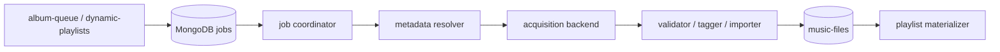

# Migrating away from `spotdl-wapper`

This document proposes a staged replacement for the current wrapper. Read
[`spotdl-wapper-current-state.md`](./spotdl-wapper-current-state.md) first for
the existing lifecycle and contracts.

## Decision summary

Do not replace `spotdl-wapper` with another all-in-one downloader service in a
single cutover. First separate queue orchestration, metadata resolution, media
acquisition, library import, and playlist materialization behind explicit
contracts.

There are then two viable product directions:

1. **Permanent local files remain a requirement.** Keep the Go worker and add a
   direct `yt-dlp` acquisition backend for content the operator is authorized
   to download. Use a pinned spotDL backend only as a temporary bridge while the
   new matching, validation, tagging, and import pipeline is proven.
2. **Official-service compliance is the priority.** Replace local acquisition
   with Spotify playback, or turn Spotify links into a wanted list fulfilled by
   an importer for user-owned or purchased files. Official Spotify playback
   does not produce local audio files or M3Us.

There is no official drop-in service that turns arbitrary Spotify URLs into
permanent DRM-free local files. Spotify's own endpoint documentation states
that applications may not facilitate downloads or stream ripping. A direct
`yt-dlp` backend changes the implementation, not that policy boundary. See
[Spotify's playlist API policy note](https://developer.spotify.com/documentation/web-api/reference/get-playlist)
and the [YouTube Terms of Service](https://www.youtube.com/t/terms).

## Why a backend swap alone is insufficient

The current component name hides five responsibilities:



spotDL currently supplies source search, candidate matching, download,
transcoding, and tagging. The Go wrapper supplies the other responsibilities,
but infers success later through artist/title catalog matching. Replacing only
the executable would preserve the weakest parts of the design:

- no atomic job claim or lease;
- boolean/counter lifecycle instead of durable states;
- no structured acquisition result;
- no stable track identity beyond artist/title;
- an untracked asynchronous indexer in the completion path;
- two owners for playlist reconciliation and M3U output.

The migration should therefore replace the acquisition engine and repair its
surrounding boundary independently.

## Options considered

| Option | Local files and M3U | Change size | Long-term fit |
| --- | --- | --- | --- |
| Pin and harden the spotDL CLI | Yes | Small | Transition only |
| Embed spotDL or run a Python sidecar | Yes | Medium | Poor |
| Direct `yt-dlp` acquisition adapter | Yes | Medium/large | Recommended only for authorized local-file use |
| Lidarr | Yes | Large product change | Poor for the current per-track Spotify queue |
| Official Spotify playback | No | Large product change | Recommended when playback is the real goal |
| Owned/purchased-file importer | Yes | Medium | Recommended compliance-oriented library path |

### Pinned spotDL CLI

This is the lowest-risk bridge, not the destination:

- pin exact `spotdl`, `yt-dlp`, and `yt-dlp-ejs` versions and image digests;
- install the JavaScript runtime required by that pinned combination;
- persist and use cache data instead of passing `--no-cache`;
- use an explicit operation and a wrapper that returns structured JSON;
- record the final path and source identity rather than waiting for a scan.

spotDL is still active, but its 4.5 releases changed Spotify behavior,
JavaScript-runtime guidance, and the library's async API. Version isolation is
therefore essential. See the
[spotDL release history](https://github.com/spotDL/spotify-downloader/releases).

### spotDL library or sidecar

This retains spotDL's useful candidate matching and metadata work, but keeps the
same volatile dependency chain while coupling the project to an internal
Python API. If it is used during transition, isolate it behind a small,
versioned HTTP or JSON-lines protocol. Do not import it directly into queue
state logic.

### Direct `yt-dlp`

This removes one layer while preserving the current local-library product
shape. It also means Harmoniq must own all logic that spotDL previously hid:

- candidate discovery and scoring;
- live/remix/cover/nightcore/version rejection;
- duration and edition validation;
- media extraction and FFmpeg conversion;
- tag and artwork writing;
- deterministic paths, checksums, and idempotency;
- typed handling of unavailable, rejected, and retryable results.

For a Go caller, use stable machine output such as `-J`, `--print`, and
`--progress-template`; yt-dlp explicitly advises against parsing its normal
stdout. `--print after_move:filepath` supplies the post-processed path, and a
download archive can deduplicate source IDs. See the
[yt-dlp embedding guidance](https://github.com/yt-dlp/yt-dlp/blob/master/README.md#embedding-yt-dlp).

Download into a per-job temporary directory, validate with `ffprobe`, write
tags, calculate a checksum, and atomically move the completed asset. Streaming
audio through stdout is a poor fit because this repository needs a durable
file, stable path, catalog record, and M3U entry.

### Lidarr

Lidarr is an album/library manager built around indexers and Usenet/BitTorrent
download clients. It can organize and upgrade a library, but it does not
preserve this repository's Spotify URL, per-track retry, playlist, and Telegram
queue contract. It becomes attractive only if the product intentionally shifts
from playlist/track ingestion to album-centric collection management. See the
[Lidarr project](https://github.com/Lidarr/Lidarr).

### Official playback

If the desired outcome is home playback rather than ownership of files, use
user OAuth with official Spotify playback surfaces. This removes acquisition,
indexing, tagging, and M3U generation for Spotify-origin content, but requires
players that understand Spotify URIs and generally a Premium account. See the
[Web Playback SDK](https://developer.spotify.com/documentation/web-playback-sdk)
and [playback-control endpoint](https://developer.spotify.com/documentation/web-api/reference/start-a-users-playback).

### Owned or purchased file import

Spotify metadata can describe wanted tracks without being the acquisition
mechanism:

1. Resolve a request into a canonical wanted item.
2. Mark it `awaiting_asset`.
3. Accept a user-owned or purchased file through a watch folder.
4. Validate, identify, tag, and import it.
5. Complete the queue item and regenerate playlists.

This preserves a permanent local library with a clearer provenance boundary,
at the cost of losing fully automatic acquisition.

Tools that directly log into consumer streaming services to save protected
content are not recommended as the replacement. They introduce account
security, authentication, service-policy, and maintenance risks without fixing
the wrapper's orchestration problems.

## Target contracts

The coordinator should depend on provider-neutral interfaces. One possible Go
shape is:

```go
type TrackSpec struct {
    SpotifyID string
    SpotifyURL string
    ISRC string
    Artists []string
    Title string
    Album string
    Duration time.Duration
    Version string
    Explicit bool
}

type Candidate struct {
    Provider string
    SourceID string
    URL string
    Duration time.Duration
    Score float64
    Reasons []string
}

type AssetResult struct {
    Provider string
    SourceID string
    FinalPath string
    Format string
    Checksum string
    MatchScore float64
}

type AcquisitionProvider interface {
    Resolve(context.Context, TrackSpec) ([]Candidate, error)
    Acquire(context.Context, TrackSpec, Candidate) (AssetResult, error)
}
```

`Acquire` must return a structured result. Subprocess exit status and log text
are diagnostics, not the data contract.

Low-confidence resolution should produce `needs_review`, not silently choose
the first search result. Candidate scoring should use stable IDs where
available, title and artist normalization, duration difference, edition/version
markers, and source quality. Live, karaoke, cover, remix, slowed, sped-up, and
nightcore variants should be rejected unless the requested metadata indicates
that version.

## Target job lifecycle

Replace the combination of `active`, `errored`, counters, and implicit
completion with explicit durable states:

```text
pending
  -> resolving
  -> needs_review | downloading
  -> validating
  -> imported
  -> completed

Any active state -> retry_wait | failed | cancelled
```

Claim work with one atomic MongoDB `FindOneAndUpdate` operation that sets a
worker ID and lease expiry. Renew long-running leases, and allow another worker
to reclaim an expired lease. Keep the legacy booleans dual-written until
`album-queue` and `dynamic-playlists` have migrated.

Use separate attempt budgets for:

- metadata/API calls;
- candidate resolution;
- acquisition;
- validation/import;
- playlist materialization.

Indexer lag must never consume an acquisition attempt.

## Target library and playlist ownership

The importer should become the single authority for a completed asset:

1. validate codec, duration, and readability;
2. write canonical tags and provenance;
3. choose the final deterministic path;
4. atomically move the file;
5. upsert `music-files` with Spotify ID/ISRC, source ID, path, checksum, and
   timestamps;
6. return the catalog identity to the coordinator.

This removes the ambiguous `index-status` timing handshake from the download
completion path. A separate scanner can remain for externally added or edited
files, but it should be a tracked, deployable service and not decide whether an
acquisition attempt succeeded.

Move one-off playlist generation into `dynamic-playlists` or a small dedicated
materializer. It should consume catalog IDs/paths, write M3Us via temporary file
plus atomic rename, create parent directories, and safely replace prior output.
Use distinct settings for the media filename template and playlist directory.

## Staged migration

### Phase 0: stabilize the current deployment

- Stop logging configuration secrets.
- Determine whether the Spotify app uses Development or Extended Quota Mode.
- Update the Spotify adapter for current `/items` responses, user OAuth for
  owned/collaborative playlists, caching, and classified 429 handling.
- Pin all Python/runtime dependencies and add Deno or the documented runtime
  for that pinned version.
- Initialize `index-status` and either track/deploy the indexer or temporarily
  make its prerequisite explicit.
- Split `DESTINATION` into media-template and playlist-directory settings.
- Add subprocess timeouts and cancellation.

These changes are required regardless of the chosen acquisition backend.

### Phase 1: characterize and introduce seams

- Add fixture/contract tests for existing MongoDB documents.
- Add an `AcquisitionProvider` interface and put the existing spotDL invocation
  behind it.
- Return a structured path/result from the spotDL adapter.
- Add an atomic claim/lease while dual-writing legacy request state.
- Run the worker as a normal long-lived process with a ticker and graceful
  shutdown; retain polling as a fallback.

No downloader behavior should change yet. This phase creates a rollback-safe
boundary.

### Phase 2: introduce canonical identity and import

- Extend track data with Spotify ID, ISRC, album, duration, explicit/version
  data, source ID, match score, final path, checksum, and typed errors.
- Backfill what can be derived from historical Spotify URLs and `music-files`.
- Make the importer write the catalog record synchronously.
- Move playlist materialization to one owner.

Keep artist/title matching as a legacy fallback, not the primary identity.

### Phase 3: implement and shadow the replacement

For the local-file path, add a direct `yt-dlp` adapter behind a feature flag.
Initially run only `Resolve` in shadow mode:

- compare its chosen source and confidence with current successful files;
- do not download or mutate queue state;
- collect mismatches for remasters, live tracks, collaborations, non-Latin
  titles, explicit/clean editions, and unavailable tracks.

For the official/import path, use the same phase to prove Spotify playback URIs
or `awaiting_asset` watch-folder imports.

### Phase 4: canary and cut over

- Route a small, explicit request cohort to the new backend.
- Preserve per-job backend selection so retries use the same implementation.
- Keep the pinned spotDL adapter as rollback until active legacy jobs drain.
- Compare success rate, wrong-match rate, duration mismatch, retries, latency,
  and manual-review rate.
- Expand only after the canary corpus and crash/restart tests pass.

Finally remove the spotDL package/config mount, compatibility fields, and
fallback only after historical consumers no longer depend on them.

## Minimum acceptance tests

Before production cutover, cover:

- track, album, playlist, and `no_pull` requests;
- a clean database and a pre-migration database;
- duplicate URLs and two concurrent workers;
- crash after claim, during download, and after file move;
- unavailable and region-restricted tracks;
- explicit/clean, live/studio, remix/original, remaster, and cover ambiguity;
- multiple artists and non-Latin/special-character metadata;
- index/import delay without consuming download attempts;
- redownload after skipped or failed history;
- filesystem permissions and out-of-space behavior;
- deterministic tags, final paths, checksums, and idempotent M3U replacement.

## Open product decisions

Implementation should not start until these are explicit:

1. Must Spotify-origin requests end as permanent local files, or is official
   playback acceptable?
2. If files are required, what sources is the deployment authorized to use?
3. Which output formats, bitrate/quality floor, tag schema, and path layout are
   contractual?
4. May low-confidence matches wait for manual review?
5. Should historical inactive failures be retried automatically after
   migration?

The first answer chooses the backend family. The remaining answers define the
acceptance contract; they should not be delegated to whichever downloader
happens to be installed.
