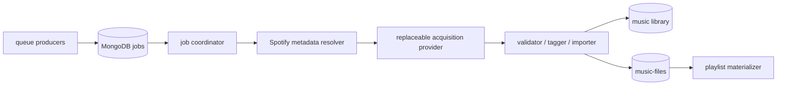

# Migrating away from spotDL

This document records the replacement decision, what has already been
implemented, and how to roll out or roll back another acquisition backend
without coupling queue correctness to that backend.

Read [`spotdl-wapper-current-state.md`](./spotdl-wapper-current-state.md) for
the exact as-built lifecycle and current limitations.

For the observed `music-services` VM, including its remote MongoDB, CIFS path
contract, legacy cron jobs, worker-only Compose manifest, cutover checks, and
rollback procedure, use
[`vm-infrastructure-spotdl-migration.md`](./vm-infrastructure-spotdl-migration.md).

## Decision

Do not replace the entire `spotdl-wapper` service with another all-in-one
downloader. Keep the Go coordinator and its MongoDB/library contracts, and
replace only the acquisition provider.

The repository now supports this decision:

- the coordinator works per track through a provider-neutral interface;
- validation, tagging, publication, and catalog upsert are provider-independent;
- spotDL is the default compatibility and rollback provider;
- direct yt-dlp is integrated as an explicit opt-in provider;
- there is no automatic fallback between providers.

The recommended direction depends on the actual product requirement:

1. **Permanent local files are required and the operator is authorized to
   obtain them.** Harden and canary the direct yt-dlp provider, keeping spotDL
   as a temporary rollback path. Add an owned/purchased-file importer as a
   provenance-safe alternative.
2. **Official-service compliance and playback are the primary goal.** Build a
   Spotify playback path. This is a product change: official playback does not
   produce local files, `music-files` records, or M3Us.
3. **Local files are required but automatic third-party acquisition is not
   acceptable.** Use Spotify metadata as a wanted list and fulfill it from a
   watch folder containing user-owned or purchased assets.

There is no official drop-in service that turns arbitrary Spotify URLs into
permanent DRM-free local files. A direct yt-dlp backend changes the software
boundary, not the operator's authorization or the applicable platform terms.
Use it only for content the deployment is allowed to download. See Spotify's
[playlist API policy note](https://developer.spotify.com/documentation/web-api/reference/get-playlist)
and the [YouTube Terms of Service](https://www.youtube.com/t/terms).

## Why the coordinator remains

The original wrapper combined five responsibilities:



Replacing the whole service would force queue ownership, retry semantics,
library paths, catalog data, and playlist behavior to change at the same time.
Keeping a provider boundary isolates the volatile part—the source search and
download tool—from the durable contracts other services consume.

This also makes a non-downloader provider possible. A watch-folder importer can
fulfill the same canonical `TrackSpec` and return a staged `AssetResult`
without changing queue state or the final-library contract.

## Implementation status

The original staged proposal is substantially implemented. This table is the
current migration ledger.

| Capability | Status | Notes |
| --- | --- | --- |
| Secret-safe startup logging | Implemented | Only an explicit non-secret allowlist is logged |
| Long-running worker and graceful shutdown | Implemented | Immediate drain plus configurable polling; command cancellation propagates |
| Current Spotify playlist endpoint | Implemented | Uses `/playlists/{id}/items` and current `item` shape |
| Spotify user refresh token | Implemented | Operator must obtain the token outside this repository |
| Spotify `429` classification | Implemented | Status is normalized across API paths; the direct items endpoint can also extend delay from `Retry-After`, while SDK errors do not expose it |
| Media/playlist path split | Implemented | `MEDIA_OUTPUT_TEMPLATE` and `PLAYLISTS_OUTPUT_PATH`; `DESTINATION` is deprecated |
| Provider-neutral contract | Implemented | `Resolve` and `Acquire` return candidates/results |
| Per-track workflow | Implemented | Albums and playlists no longer use bulk spotDL |
| Pinned spotDL compatibility provider | Implemented | Default backend and rollback path |
| Direct yt-dlp provider | Implemented | Explicit opt-in with JSON resolution and conservative scoring |
| Command timeout and process-tree cancellation | Implemented | Direct argv; Linux and Darwin child process-group cancellation |
| Canonical track/provenance fields | Implemented | Spotify/source IDs, ISRC, duration, path, format, score, checksum |
| Atomic queue claim and lease | Implemented | Random per-claim fence, heartbeat, and stale-attempt write protection |
| Explicit durable download states | Implemented | Dual-written with legacy `active`/`errored` flags |
| Typed failures and scheduled retries | Implemented | Acquisition-pipeline failures share one request-wide budget; published-artifact catalog finalization backs off without consuming it |
| Synchronous validation and catalog import | Implemented | Provider checksum verification, deterministic FFmpeg tags/artwork, FFprobe duration check, bounded paths, `0640` output, synced hard-link publication, recovery journal/resume, collision handling, and upsert |
| Private staging attempts and cleanup | Implemented | Providers use marked isolated directories; discard and the old-attempt sweeper enforce resolved no-symlink ownership |
| Removal of indexer completion gate | Implemented | Active worker paths do not use `index-status` |
| Atomic/safe one-off M3Us | Implemented | Regular-file and resolved containment checks, replace semantics, and directory sync |
| Backend affinity per request | Implemented | First claim pins an empty backend; retries and reclaims stay on it |
| Producer cohort routing and operator re-route | Not implemented | An unassigned request goes to whichever provider worker claims it first |
| Shadow resolution mode | Not implemented | Direct resolve currently occurs only while processing a real claim |
| Manual review workflow | Not implemented | `needs_review` is durable but there is no candidate UI or resume command |
| Candidate-audit persistence | Not implemented | Score is stored; component reasons and rejected candidates are not |
| Independent retry budgets by acquisition stage | Not implemented | Metadata, resolution, download, and pre-publication import share one budget; recovery-journal catalog finalization is deliberately unmetered |
| Matching quality telemetry | Not implemented | Logs exist; metrics and curated-corpus reporting do not |
| Single playlist owner | Not implemented | One-off and subscribed/dynamic flows remain split |
| External/owned-file importer | Not implemented | Synchronous import covers provider-created assets only |

## Implemented provider contract

The contract in
[`pkg/acquisition/types.go`](../spotdl-wapper/pkg/acquisition/types.go)
separates canonical intent from provider-specific candidates:

```go
type Provider interface {
    Name() ProviderName
    Resolve(context.Context, TrackSpec) ([]Candidate, error)
    Acquire(context.Context, TrackSpec, Candidate) (AssetResult, error)
}
```

`TrackSpec` carries canonical Spotify ID/URL, ISRC, artists, title, album,
duration, explicit flag, version, and allowed variants. `Candidate` carries
provider/source identity, metadata, score, and audit reasons. `AssetResult`
returns the concrete staged path, format, checksum, provider/source identity,
and match score.

The service does not infer success from logs or from a later filesystem scan.
The shared importer must accept the staged result and return a canonical
`MusicFile`.

## Backend choices

### Pinned spotDL compatibility provider

This is the lowest-risk deployment baseline and current default. It preserves
spotDL's internal matching while exercising the new leases, per-track
orchestration, importer, and catalog path.

Its limitations are deliberate:

- spotDL remains a volatile Python/downloader dependency chain;
- its chosen media source is opaque to the Go worker;
- its synthetic score of `0` means unscored rather than a rejected match;
- the current adapter disables spotDL cache;
- backend assignment happens by first claim rather than a producer-controlled
  routing policy.

Each attempt uses a private staging directory and the shared importer verifies
the staged checksum, tags and probes the file, publishes it, and updates the
catalog. The compatibility provider therefore retains spotDL matching without
giving spotDL ownership of final paths or queue state.

See the
[spotDL release history](https://github.com/spotDL/spotify-downloader/releases)
for the upstream compatibility changes that motivated isolating and pinning
this provider.

Keep it until the replacement has met the acceptance criteria and active
rollback windows have closed. It should not regain ownership of queue or
library semantics.

### Direct yt-dlp

This is the integrated replacement candidate when authorized local acquisition
is a requirement. It removes one abstraction layer but makes this repository
responsible for:

- search construction and machine-readable candidate discovery;
- title, artist, duration, and edition matching;
- wrong-version rejection;
- selection confidence and review decisions;
- extraction and post-processed path discovery;
- provenance and auditability.

The implementation uses yt-dlp JSON for resolution and
`after_move:filepath` for acquisition output. It does not parse normal
human-oriented progress logs. See yt-dlp's
[embedding guidance](https://github.com/yt-dlp/yt-dlp/blob/master/README.md#embedding-yt-dlp).

The current matcher is suitable for a canary, not yet for unattended global
cutover. It does not distinguish explicit from clean recordings, persist all
candidate evidence, or expose an operator decision flow. Real-source behavior
must be measured with an authorized, curated corpus.

### Owned or purchased file import

A compliance-oriented local-library path can reuse most of the integrated
pipeline:

1. Resolve a Spotify request into canonical track specifications.
2. Transition the track to a new `awaiting_asset` state.
3. Accept an authorized file from a watch folder or upload boundary.
4. Identify and compare the file to the wanted track.
5. Pass it through the existing validator/tagger/importer.
6. Complete the request and rematerialize affected playlists.

The missing work is a durable association between an incoming file and a
`TrackSpec`, an operator-visible ambiguous-match queue, malware/format
screening appropriate to uploads, and retention rules for rejected inputs.

### Official Spotify playback

If local file ownership is not essential, official Spotify playback removes
the acquisition, tagging, and file-import problem. It requires user OAuth,
Spotify-compatible playback clients, and usually Premium. Existing M3U and
filesystem consumers would need a separate URI-based contract.

See the [Web Playback SDK](https://developer.spotify.com/documentation/web-playback-sdk)
and [playback-control API](https://developer.spotify.com/documentation/web-api/reference/start-a-users-playback).

This is not selectable through the current `Provider` interface because a
playback URI is not a staged local asset. Treat it as a deliberate product
fork, not another downloader adapter.

### Lidarr and a spotDL sidecar

Lidarr is useful for album/library management backed by indexers and download
clients, but it does not preserve the current Spotify per-track queue,
provenance, review, and playlist contracts. Adopt it only if the product moves
to album-centric collection management. See the
[Lidarr project](https://github.com/Lidarr/Lidarr).

Embedding spotDL's Python API or introducing a spotDL sidecar would retain the
same dependency chain while adding another service boundary. If a temporary
sidecar becomes necessary, keep a small versioned JSON protocol and leave all
state transitions in the Go coordinator.

## Required work before a production yt-dlp cutover

### 1. Make backend routing controllable

Backend affinity itself is durable: a claim accepts work assigned to its
configured provider or atomically assigns an empty backend, and later retries
and reclaims retain that value. Remaining routing work is:

- let a producer or routing policy assign the backend before general workers
  race to claim a new request;
- define an explicit cohort model for canaries;
- add an operator action to re-route a paused/failed request and define whether
  it resets attempt state;
- record routing changes as audit events;
- alert when unfinished requests are pinned to a provider with no workers.

Running differently configured workers is safe from cross-provider retry
drift, but it is not a controlled canary: the first claimant determines the
backend for every unassigned request. There is no built-in re-route operation.

### 2. Add review operations

`needs_review` correctly stops automatic acquisition, but it needs an
operational interface that can:

- show canonical metadata, all accepted/rejected candidates, scores, and
  rejection reasons;
- approve a candidate without changing canonical metadata;
- reject or cancel the request;
- edit allowed variant intent when the requested recording is genuinely live,
  remix, cover, or another alternate;
- reset the appropriate attempt budget and return the request to `pending`;
- retain reviewer identity, time, and decision.

Do not implement review as manually editing MongoDB fields in normal
operations.

### 3. Persist candidate evidence

Store at least the resolver query, tool/provider version, candidate source ID
and URL, title/artists/duration/uploader, component scores, rejection reason,
selection decision, and timestamp. Bound the number and size of candidates to
avoid unbounded queue documents.

This is necessary for diagnosing wrong matches and comparing a future matcher
without redownloading.

### 4. Close matching gaps

Extend or explicitly decline support for:

- explicit versus clean editions;
- remaster/original and radio/full-length edition intent;
- featured-artist and transliteration normalization;
- regionally substituted Spotify recordings;
- missing/incorrect source duration;
- source/channel trust and audio quality;
- tracks whose title legitimately contains a strict marker as ordinary text.

Use stable source IDs and known recording IDs where available, but do not
assume ISRC alone proves that a user-uploaded video contains the exact audio.

### 5. Improve operational safety

Add metrics and alerts for queue depth/age, lease expiry and reclaim, state
transition counts, provider latency/error rate, review rate, duration mismatch,
catalog upsert errors, and orphan-file recovery. Add a worker readiness signal
that verifies MongoDB and configured executable availability without
downloading content.

Alert specifically on repeated recovery-journal finalization failures. Those
retries intentionally preserve `WORKER_MAX_ATTEMPTS`, so the worker will not
turn a valid published artifact into `failed` merely because catalog
finalization remains unavailable.

Create an orphan reconciler for the remaining publish-before-journal crash
window. Normal catalog failures are recoverable from the imported
path/checksum journal, but the filesystem and MongoDB cannot make publication
and that first journal write one transaction. Reconciliation must use checksums
and canonical IDs and must never blindly delete files. Private staging attempts
already have bounded cleanup.

### 6. Finish playlist consolidation

Move one-off and subscribed/dynamic playlists behind one materialization
contract, or give each clearly disjoint ownership. The one-off queue should
gain claims/leases and should wait on the exact missing track jobs. Missing
files now wait without consuming retry count or writing a partial
non-`no_pull` M3U, but a suppressed/review/successful dependency with no usable
catalog file can still leave the playlist active forever. Ensure playlist work
also receives fair scheduling when downloads are continuously available.

## Rollout plan

### Stage A: deploy the new coordinator with spotDL

Keep `ACQUISITION_BACKEND=spotdl`. This changes orchestration and import while
retaining the familiar acquisition engine.

Before deployment:

- back up MongoDB and the library metadata needed for recovery;
- verify staging, media, and playlist paths are writable by UID 10001;
- verify the spotDL config mount in both configured locations;
- inspect duplicate Spotify IDs that could prevent the unique sparse identity
  index; duplicate checksums are valid and the checksum index is non-unique;
- configure a Spotify refresh token when Development Mode playlist access is
  required;
- record the current container image identifier and environment for rollback.

During the soak, verify request leases, retry scheduling, imported paths/tags,
catalog identities, recovery from a failed catalog upsert without
reacquisition, multi-track resume, and playlist replacement. Do not enable
direct yt-dlp merely because the process is stable; matching needs separate
validation.

### Stage B: build a non-mutating comparison path

Add a shadow resolver that reads a representative sample of completed
canonical tracks and executes direct yt-dlp `Resolve` without claiming jobs,
downloading files, or mutating queue state.

Compare the top candidate against known-good files for:

- studio/live and original/remix boundaries;
- remasters, edits, acoustic, instrumental, covers, slowed/sped-up/nightcore;
- multiple artists, punctuation, transliteration, and non-Latin titles;
- explicit/clean releases;
- unavailable, regional, and metadata-incomplete tracks.

Store bounded comparison results outside active request state. Define an
acceptable wrong-match rate and review rate before proceeding.

### Stage C: route an explicit canary

Implement producer-controlled backend assignment or a routing service first.
Route only a small, auditable cohort of authorized requests to `yt-dlp`; leave
all other work on spotDL. First-claim pinning prevents retry drift but cannot
select this cohort by itself.

Recommended gates:

- no automatic cross-provider fallback;
- a functioning review/resume operation;
- curated-corpus results accepted by an operator;
- alarms for stuck leases, elevated retries, and review-rate changes;
- verified file/catalog recovery after termination at every state boundary;
- provenance and the exact provider/tool version visible per imported track.

Increase the cohort gradually. Compare successful import rate, manual-review
rate, confirmed wrong-match rate, retry distribution, duration mismatch,
latency, and storage effects—not just downloader exit status.

### Stage D: make yt-dlp primary

Only after the canary gates hold, route new authorized local-file requests to
yt-dlp by default. Keep spotDL installed and pinned for a defined rollback
period, but do not automatically invoke it when direct resolution fails.

Drain or intentionally re-route spotDL-assigned jobs. Document who may
re-route a job and whether doing so resets attempts. Continue to support
`needs_review`; a lower success rate can be safer than a higher wrong-match
rate. Until an audited re-route operation exists, keep a spotDL worker
available for spotDL-pinned unfinished jobs or explicitly cancel and resubmit
them as newly routed work.

### Stage E: retire spotDL

Remove spotDL only when:

- no active/retry/review job is assigned to it;
- historical provenance is readable without the executable;
- the rollback window has expired;
- the direct or owned-file path meets the agreed quality and legal policy;
- container, Compose, configuration, and operator docs no longer reference its
  config mounts;
- an image without spotDL passes the full acceptance suite.

Remove compatibility fields and dead indexer code separately. They have
different consumers and should not be bundled into the downloader removal.

## Rollback

### Current implementation

Backend affinity must be preserved during rollback:

1. Stop yt-dlp workers so they stop claiming unassigned requests and gracefully
   release interrupted yt-dlp claims.
2. Preserve MongoDB and the library; do not delete imported files, clear
   backend values, or rewrite catalog provenance.
3. Before starting another worker, inventory all unassigned requests plus
   yt-dlp-pinned `claimed`, expired-lease, `retry_wait`, `needs_review`, and
   failed requests. Approve, cancel, or otherwise account for every unassigned
   request so it cannot race the provider transition.
4. Keep or start a worker with `ACQUISITION_BACKEND=spotdl` and the last
   known-good pinned image/config. It can claim unassigned and spotDL-pinned
   work, but correctly will not take yt-dlp-pinned work.
5. For each unfinished yt-dlp-pinned request, deliberately choose to let a
   yt-dlp worker finish it, cancel and resubmit it while only spotDL workers can
   claim the new unassigned work, or use a future audited re-route operation.

There is no built-in re-route operation today. Do not implement rollback by
blindly clearing or replacing `backend`: doing so discards the affinity
guarantee and obscures acquisition history.

Files already imported by yt-dlp remain valid catalog entries with yt-dlp
provenance. Rollback must not pretend they came from spotDL.

### After controlled routing is added

Stop assigning new work to yt-dlp, allow safe in-flight jobs to finish or
cancel them through queue state, and route new work to spotDL. Leave existing
yt-dlp-assigned retry/review jobs pinned unless an operator explicitly
re-routes them. Rollback should be a routing change, not a database restore.

## Data compatibility

The download state machine is additive. Legacy documents without `state` are
claimable as pending, and the worker dual-writes `active`/`errored` for existing
readers. New producers create `state=pending`.

Before removing compatibility:

- update every consumer to interpret explicit state;
- distinguish `retry_wait` from `needs_review` in user-facing queue output;
- stop using `active` alone as success or failure;
- retain the ability to resubmit `failed` and `cancelled` work intentionally;
- backfill stable Spotify identity where reliable;
- resolve legacy duplicate Spotify IDs before enforcing the sparse unique
  Spotify-ID index;
- preserve legitimate duplicate checksums; the checksum index is intentionally
  non-unique, and decide separately whether ISRC or path should become unique;
- decide how much historical candidate/result/error data to retain.

`music-files` should keep source provenance permanently. A future provider
change must update mutable metadata without erasing the original source
identity accidentally.

The download precheck now matches Spotify ID, then ISRC, then identity-less
legacy artist/title and validates the referenced file and optional checksum.
The database upsert itself builds its filter from only the first non-empty
input identity—Spotify ID, otherwise ISRC, otherwise path—so reconciliation
must not assume it performs sequential fallback lookups.

## Acceptance criteria

Before making a replacement provider primary, test:

- track, album, playlist, empty/unavailable playlist items, and `no_pull`;
- clean database, legacy state-less documents, and duplicate legacy catalog
  data;
- two workers with the same and different providers, first-claim backend
  pinning, lease expiry/reclaim, random claim fencing, and stale-attempt write
  rejection;
- termination after claim, during resolve/download/tag/probe, after publish
  before the recovery journal, after the journal, after catalog upsert, and
  after per-track progress;
- scheduled retry, direct-endpoint Spotify `Retry-After`, SDK status
  normalization, acquisition-attempt exhaustion, budget-preserving
  recovery-journal finalization retries, review, cancel, approve, and explicit
  provider re-route;
- unavailable and region-restricted tracks;
- explicit/clean, live/studio, remix/original, remaster, acoustic,
  instrumental, cover/karaoke, slowed/sped-up/nightcore, and radio/full edit
  ambiguity;
- multiple artists, punctuation, non-Latin metadata, and malicious path/title
  characters;
- incorrect source duration, provider-checksum mismatch, corrupt/empty media,
  all six configured output formats, unsupported codec, no space, permissions,
  and read-only mounts;
- deterministic tags, artwork policy, `0640` modes, paths, checksums, collision
  behavior, component-length bounds, OGG/Opus retry determinism, sync
  boundaries, discard, orphan-attempt cleanup, and idempotent reprocessing;
- complete, `no_pull` partial, empty, missing-file wait, and replacement M3Us;
- container startup checks and a real MongoDB/tool end-to-end path.

Success means a correct, auditable library artifact—not merely a zero
subprocess exit code.

## Product decisions still required

1. Must Spotify-origin requests end as permanent local files, or can they end
   as official playback URIs?
2. Which media sources and content is this deployment authorized to use?
3. Which formats, codec/bitrate floor, tags, artwork, loudness, and path layout
   form the library contract?
4. What wrong-match and review rates are acceptable?
5. Who may approve, cancel, or re-route a request, and how is that decision
   audited?
6. Should externally added owned files become a first-class acquisition path?
7. Which service owns all playlist materialization?

The first two questions choose the valid backend family. The remaining answers
define whether the integrated direct provider is ready to move beyond a
canary.
