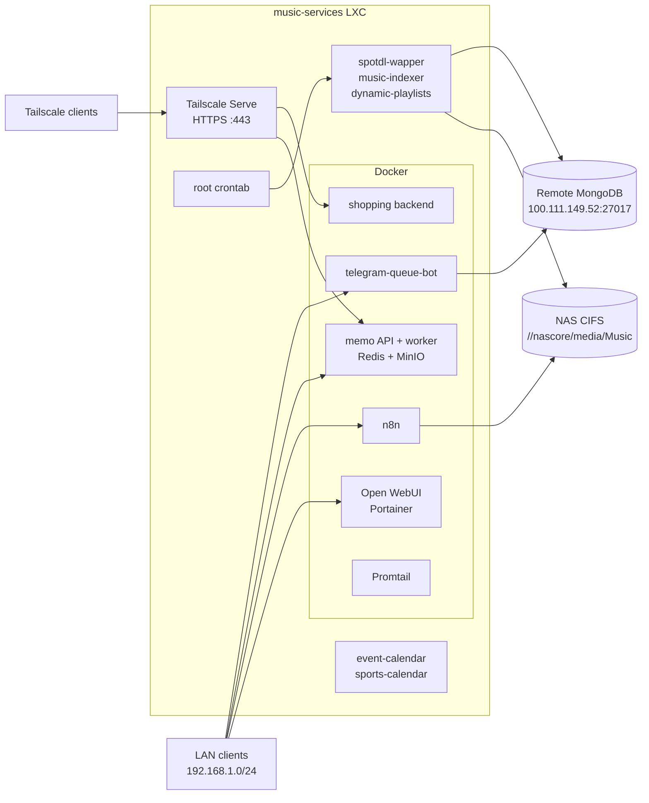

# `music-services` VM infrastructure: current state

This document records the observed state of the `music-services` VM on
2026-08-01. It is an as-built snapshot, not a deployment specification.
The change-authorized migration plan derived from this snapshot is
[`vm-infrastructure-spotdl-migration.md`](./vm-infrastructure-spotdl-migration.md).

| Item | Value |
|---|---|
| Observation window | 2026-08-01 21:30:22 to approximately 21:39 CEST |
| Hostname | `music-services` |
| Access path | SSH through the `music-services` alias / Tailscale |
| Method | Administrative inspection commands only; no workload probes |
| Secret handling | Passwords, tokens, keys, and credential values are omitted |

The labels used throughout this document are:

- **Observed on VM**: returned by the running VM during the snapshot;
- **Declared in repository**: present in the local repository working tree and
  not proof of deployment;
- **Inferred**: a conclusion supported by multiple observations but not directly
  verified;
- **Unknown**: intentionally not inspected or not visible from inside the guest.

## No-change constraint and audit disclosure

The audit was requested with a strict no-change constraint. No service,
container, scheduler, application, configuration, package, firewall rule,
mount, database, or workload file was deliberately changed. No application
binary or scheduled wrapper was executed. No health endpoint, database client,
container shell, update command, or backup command was invoked.

A literal zero-write SSH inspection is not possible: SSH authentication and
disconnects normally update system authentication, journal, and login-accounting
records, and file reads can update access-time metadata.

There was also one discovered exception beyond normal SSH accounting. Running
`git status` in two repositories refreshed their Git index metadata, and the
pager used by Git updated its history file at `2026-08-01 21:37:14 CEST`:

- `/root/shopping-app/.git/index`;
- `/root/memo-app/.git/index`;
- `/root/.lesshst`.

No source file, application configuration, service state, container state,
scheduler entry, or application data was changed. The metadata was not restored
because doing so would have introduced further writes. The SSH session was
closed after this was confirmed.

## Executive summary

**Observed on VM:** `music-services` is a Debian 12 LXC guest hosted by Proxmox.
It has 6 vCPUs, 4 GiB RAM, a 32 GiB root filesystem, Docker, Tailscale, cron,
Tor, Postfix, and two custom systemd services. Eleven of twelve Docker
containers were running.

The Harmoniq/music workflow is a hybrid legacy deployment rather than the
Compose topology currently declared in this repository:

- `telegram-queue-bot` runs as a standalone Docker container and is strongly
  inferred to be the deployed `album-queue` service from its image and
  environment-variable names;
- `spotdl-wapper`, `music-indexer`, and `dynamic-playlists` are root-owned
  binaries in `/root` launched by root's crontab;
- all three scheduled binaries use a remote MongoDB endpoint at
  `100.111.149.52:27017` over the Tailscale-addressed network;
- music and playlists live on a CIFS share from
  `//nascore/media/Music` mounted at `/mnt/music`;
- there is no live `harmoniq` Compose project, local MongoDB container, or
  running `spotdl-wapper`/`dynamic-playlists` container.

The Linux scheduling facility the original note refers to is **cron**, managed
through root's **crontab**. Three music jobs were present: `spotdl-wapper`,
`music-indexer`, and `dynamic-playlists`.

The most material current-state findings are:

- the VM firewall accepts inbound traffic by default, while several database,
  object-storage, application, and administration ports bind to all VM
  interfaces;
- `telegram-queue-bot` and `assistant-bot` have been running with Docker health
  state `unhealthy` for months;
- `music-indexer` is invoked every ten minutes, but its log repeatedly reports
  `error walking` before `Scan complete`;
- the dynamic-playlists cron entry has no overlap lock or timeout;
- guest-visible workload backups were not found;
- the deployed Harmoniq binaries predate the inspected repository state by
  roughly five to six months, but no source revision was extracted or mapped;
- swap was almost fully occupied, although 2.3 GiB of RAM remained available
  at the snapshot.

## Observed topology

The direct LAN edges represent listener binding to `0.0.0.0`/`*`, not verified
LAN reachability. They also do not assert that the services are reachable from
the public Internet; upstream router, Proxmox firewall, and network ACL state
were not visible from the guest.

## Host and resource baseline

**Observed on VM:**

| Property | Snapshot |
|---|---|
| Distribution | Debian GNU/Linux 12 (`bookworm`) |
| Kernel | `6.8.12-9-pve` on `x86_64` |
| Virtualization | LXC on Proxmox |
| CPU | 6 vCPUs; host model reported as Intel Core i5-8500T @ 2.10 GHz |
| Uptime | 192 days, 10 hours |
| Load average | `0.79`, `1.00`, `0.91` |
| Memory | 4.0 GiB total, 1.7 GiB used, 2.3 GiB available |
| Swap | 512 MiB total, 510 MiB used |
| Time zone | `Europe/Prague`; CEST (`UTC+02:00`) at observation |
| Clock | system clock synchronized; guest NTP service reported inactive |
| systemd state | `running`; zero failed units |

The near-full swap value is a point-in-time condition, not by itself proof of
current memory pressure. The guest still reported 2.3 GiB available memory.

### Filesystems

| Mount | Source/type | Capacity | Use | Purpose |
|---|---|---:|---:|---|
| `/` | `/dev/mapper/pve-vm--106--disk--0`, ext4 | 32 GiB | 19 GiB / 64% | Guest OS, Docker layers, local volumes, logs |
| `/mnt/music` | `//nascore/media/Music`, CIFS | 16 TiB | 12 TiB / 77% | Music library and job output |
| Docker `music-library` | `//nascore/media/Music`, CIFS local volume | same NAS | same backing share | Mounted into `n8n` as `/music-library` |
| Docker `job-downloaded` | `//nascore/media/Music/Job-downloaded`, CIFS local volume | same NAS | same backing share | Mounted into `n8n` as `/downloaded` |

`/etc/fstab` contains the CIFS username and password inline. Their values are
omitted here. It mounts the share with SMB 3.0 and maps ownership to UID/GID
1000. NAS-side snapshots, replication, and recovery policy are **Unknown**.

## Network and exposure

### Interfaces and routing

**Observed on VM:**

- LAN: `192.168.1.223/24` on `eth0`, default gateway `192.168.1.1`;
- Tailscale: `100.121.131.87/32` on `tailscale0`;
- Docker bridges: `172.17.0.0/16`, `172.18.0.0/16`, `172.19.0.0/16`, and
  `172.20.0.0/16`;
- Tailscale version: `1.96.4`.

Tailscale Serve provides tailnet-only HTTPS at
`https://music-services.tailf01628.ts.net`:

| Path | Upstream |
|---|---|
| `/` | `http://127.0.0.1:38173` (`deploy-backend-1`) |
| `/memo` | `http://127.0.0.1:28080` (`memo-backend-api-1`) |
| `/minio` | `http://127.0.0.1:29000` (`memo-backend-minio-1`) |

The memo and MinIO upstreams also bind directly to `0.0.0.0`, so Tailscale
Serve is not their only guest-level ingress path.

### Listening sockets

| Bind | Owner/workload | Notes |
|---|---|---|
| `*:22/tcp` | SSH | Root password authentication succeeded for this audit; effective SSH Match rules were not inspected |
| `127.0.0.1:25/tcp` | Postfix | Local mail delivery |
| `100.121.131.87:443/tcp` | Tailscale | Tailnet-only HTTPS Serve endpoint |
| `127.0.0.1:9050/tcp` | Tor | Local SOCKS listener |
| `127.0.0.1:38173/tcp` | shopping backend | Docker-published loopback upstream |
| `*:5678/tcp` | `n8n` / Node | Container uses host networking |
| `0.0.0.0:3000/tcp` | Open WebUI | Docker-published |
| `0.0.0.0:8000/tcp` | Portainer | Docker-published |
| `0.0.0.0:8080/tcp` | `telegram-queue-bot` | Docker-published |
| `0.0.0.0:9443/tcp` | Portainer HTTPS | Docker-published |
| `0.0.0.0:26379/tcp` | Redis | Docker-published |
| `0.0.0.0:28080/tcp` | memo API | Docker-published |
| `0.0.0.0:28081/tcp` | memo worker | Docker-published |
| `0.0.0.0:29000/tcp` | MinIO API | Docker-published |
| `0.0.0.0:29001/tcp` | MinIO console | Docker-published |
| `0.0.0.0:41641/udp` | Tailscale | WireGuard transport |

### Firewall

**Observed on VM:** `ufw` is not installed. `nftables.service` is enabled, but
the base IPv4 and `inet` input chains have policy `accept`. Tailscale adds its
anti-spoofing and interface rules, and Docker manages forwarding/NAT rules.
There is no guest-level default-deny policy protecting the published
`0.0.0.0` ports.

The guest uses private LAN addressing, so public-Internet exposure is
**Unknown**. Proxmox host firewall rules, router NAT, Tailscale ACLs, and tailnet
device policy were outside the audit scope.

## systemd services and timers

The important running services were Docker/containerd, cron, SSH, Tailscale,
Tor, Postfix, journald, networking, and two custom calendar bots. There were no
failed units.

### Custom services

| Unit | Runtime identity | Executable and working directory | Configuration source | Restart | State |
|---|---|---|---|---|---|
| `event-calendar.service` | `event-calendar:event-calendar` | `/opt/event-calendar/event-calendar`; `/var/lib/event-calendar` | `/etc/event-calendar/event-calendar.env`, root-owned `0600` | `always`, 10 s | enabled and running |
| `sports-calendar.service` | `sports-calendar:sports-calendar` | `/opt/sports-calendar/sports-calendar`; `/opt/sports-calendar` | `/etc/sports-calendar/openai.env` and `sports-calendar.env`, root:`sports-calendar` `0640` | `on-failure`, 5 s | enabled and running |

Both units enable `NoNewPrivileges` and private temporary directories. The
sports service uses the stricter of the two sandboxes (`ProtectSystem=strict`,
kernel/control-group protections, and restricted address families).
Their unit fragments are `/etc/systemd/system/event-calendar.service` and
`/etc/systemd/system/sports-calendar.service`.

### systemd timers

Only distribution-provided timers were found: APT daily maintenance,
`dpkg-db-backup`, filesystem scrub/trim, log rotation, man-db, and systemd
temporary-file cleanup. No custom application systemd timer was present. The
application scheduler is cron.

## Cron-scheduled music workflows

### Root crontab

**Observed on VM:** `/var/spool/cron/crontabs/root` was the only user crontab.
The timezone is `Europe/Prague`.

| Job | Schedule | Effective execution | Concurrency/timeout | Output | Last invocation observed | Invocations in prior 7 days |
|---|---|---|---|---|---|---:|
| `spotdl-wapper` | `*/60 * * * *` | `/root/run_spotdl-wapper.sh` as root, effectively at minute `00` each hour | non-blocking `/tmp/spotdl.lock`; 55-minute timeout, then 10-second kill grace | cron mail | 2026-08-01 21:00:01 CEST | 168 |
| `music-indexer` | `*/10 * * * *` | `/root/run_music-indexer.sh` as root | non-blocking `/tmp/indexer.lock`; 9-minute timeout, then 10-second kill grace | append to `/var/log/music-indexer.log` | 2026-08-01 21:30:01 CEST | 1,008 |
| `dynamic-playlists` | `*/10 * * * *` | `/root/run_dynamic-playlists.sh` as root | none | cron mail | 2026-08-01 21:30:01 CEST | 1,008 |

The seven-day counts exactly match the expected trigger counts. They prove that
cron issued the commands, not that every binary completed successfully. None
of the three processes or lock holders was active at the point-in-time process
snapshot.

`*/60` in the minute field is non-idiomatic, but the journal shows the job
triggering at minute `00` every hour. The two `flock -n` jobs skip a launch when
the previous process still holds its lock. `dynamic-playlists` has neither a
lock nor a timeout, so a run lasting longer than ten minutes can overlap the
next one.

### Wrapper behavior and safe configuration

The wrappers contain environment assignments followed by direct execution of
the corresponding binary. Secret values were not copied into this document.

| Wrapper | Target | Non-secret observed settings |
|---|---|---|
| `/root/run_spotdl-wapper.sh` | `exec /root/spotdl-wapper` | destination `/mnt/music/Job-downloaded/`; library `/mnt/music/`; `SLEEP_IN_MINUTES=0`; `BLOB_ENABLED=false`; spotDL config `/root/.spotdl/config.json`; Loki enabled at `dashboard:3100` |
| `/root/run_music-indexer.sh` | `/root/music-indexer` | database `music-services`; collection `music-files`; scan root `/mnt/music/Job-downloaded` |
| `/root/run_dynamic-playlists.sh` | `exec /root/dynamic-playlists` | database `music-services`; library `/mnt/music/Job-downloaded/`; output `/mnt/music/Job-downloaded/Playlists/`; `DRY_RUN=false` |

All three wrappers reference MongoDB at `100.111.149.52:27017`. Credentials are
embedded in the wrapper assignments and omitted here. Spotify credentials are
present in the spotDL and dynamic-playlists wrappers; an OpenAI key is present
in the dynamic-playlists wrapper. The spotDL wrapper also contains Loki
configuration. `/root` is mode `0700`, which limits traversal, although the
wrapper files themselves are mode `0755`.

`/root/.spotdl/config.json` exists as root:root mode `0644` under the `0700`
root home. Its contents were not inspected.

### Deployed artifact provenance

All six artifacts are root:root mode `0755`. The Go binaries are statically
linked x86-64 executables with debug information. The usual `go version -m`
helper was unavailable because the Go toolchain was not installed, so no
module/build revision was extracted or mapped to source.

| Artifact | Size | Modified | SHA-256 |
|---|---:|---|---|
| `/root/run_spotdl-wapper.sh` | 529 B | 2026-01-21 10:22:30 CET | `74cab7b915e4e0bd1c6f216759b3e2ef029e083f75afbadbda5e378eb5d13f3a` |
| `/root/spotdl-wapper` | 13,562,354 B | 2026-02-03 18:24:18 CET | `cc56be503dd0fc35df690b2a3f3c4825d6bcfad46e5c41dfc35f0c55ce161d63` |
| `/root/run_music-indexer.sh` | 211 B | 2025-06-22 22:23:05 CEST | `e40618f92d1ea8ee189ef8854c25f5b19f9ec0940cda5a60c7dd2b9f5213d79c` |
| `/root/music-indexer` | 13,065,718 B | 2026-01-20 20:27:51 CET | `23d937e6f7bb60620f13a783b9168661b71ec74d465824abde6673cdc11c2b34` |
| `/root/run_dynamic-playlists.sh` | 576 B | 2026-02-08 22:32:43 CET | `65c1def85e7ba8e400ce1ac3cbb34dabeda66c9ed0948db68199b2dbb72f250b` |
| `/root/dynamic-playlists` | 13,455,565 B | 2026-02-08 22:29:26 CET | `1d6598636ae158fb31161234c9e0bd5b48b4edc3c40769111ee8bc777dd54ad5` |

## Docker

### Engine baseline

**Observed on VM:** Docker Engine `28.1.1`, API `1.49`, `overlay2`, systemd
cgroups v2, default `journald` logging, and inactive Swarm mode. Docker reported
12 containers, 11 running, one stopped, and 45 images.

Compose reported three projects:

| Project | State | Configuration provenance |
|---|---|---|
| `deploy` | one running container | `/root/shopping-app/deploy/docker-compose.tailscale.yml` |
| `memo-backend` | four running containers | `/root/memo-app/backend/docker-compose.yml` |
| `promtail` | one running container | Compose label refers to missing `/data/compose/1`; live config bind is `/root/promtail.yaml` |

The `shopping-app` checkout was on `master` at
`b43ed07435806952223a827f4a5458a2643227a6`; `memo-app` was on `main` at
`2b9f273c917da1600f88a8b947cc64709789e537`. The Git metadata disclosure at the
start of this document applies to these two checkouts.

### Container inventory

Image IDs are abbreviated deployed image object IDs, not registry digests.

| Container | Image / image ID | State | Published ports | Restart | Persistence or sensitive host access |
|---|---|---|---|---|---|
| `deploy-backend-1` | `shopping-app-backend:local` / `c75f6c161526` | up 6 weeks; no health state | `127.0.0.1:38173 -> 8080` | unless-stopped | none |
| `memo-backend-api-1` | `memo-backend:local` / `7e9c6d8aa974` | up 2 months; healthy | `0.0.0.0:28080 -> 8080` | unless-stopped | none |
| `memo-backend-worker-1` | `memo-backend:local` / `7e9c6d8aa974` | up 2 months; healthy | `0.0.0.0:28081 -> 8081` | unless-stopped | none |
| `memo-backend-minio-1` | `minio/minio:RELEASE.2024-10-02T17-50-41Z` / `162489e21d26` | up 2 months; no health state | `0.0.0.0:29000 -> 9000`, `29001 -> 9001` | unless-stopped | `memo-backend_minio_data:/data` |
| `memo-backend-redis-1` | `redis:7-alpine` / `487efc061638` | up 2 months; healthy | `0.0.0.0:26379 -> 6379` | unless-stopped | anonymous local volume at `/data` |
| `open-webui` | `ghcr.io/open-webui/open-webui:main` / `b23bb1d639ad` | up 3 months; healthy | `0.0.0.0:3000 -> 8080` | unless-stopped | `open-webui:/app/backend/data`; runs as container UID 0 |
| `sweet_cartwright` | untagged `705262d61baa` | exited code 1 three months earlier; unhealthy health record | none | no | none |
| `telegram-queue-bot` | `telegram-queue-bot:latest` / `60c60f084dee` | up 5 months; **unhealthy** | `0.0.0.0:8080 -> 8080` | unless-stopped | none |
| `assistant-bot` | `telegram-assistant-bot:latest` / `705262d61baa` | up 3 months; **unhealthy** | internal `8080` only | no | none |
| `promtail` | `grafana/promtail:2.9.4` / `1c7475004f2f` | up 6 months; no health state | none | unless-stopped | `/root/promtail.yaml` read/write; Docker container logs and socket read-only |
| `n8n-music-services` | `n8nio/n8n:latest` / `67df7b0728a7` | up 6 months; no health state | host network, observed `*:5678` | unless-stopped | `n8n`, `scripts`, both NAS music volumes; runs as root |
| `portainer` | `portainer/portainer-ce:latest` / `2a17f0992b45` | up 6 months; no health state | `0.0.0.0:8000`, `9443` | always | `portainer_data`; Docker socket |

The `telegram-queue-bot` environment-variable names match the repository's
`album-queue` configuration (`DATABASE_URL`, bot, webhook, and Spotify names),
but exact source revision equivalence is **Inferred**, not proven. Container
environment values were not recorded.

### Docker persistence

Local named volumes are present for MinIO, Open WebUI, n8n, Portainer, and
scripts, plus an anonymous Redis data volume. The two CIFS-backed volumes map
the NAS into n8n. No local MongoDB data volume or MongoDB container was present.

`/root/memo-app/backend/.env` and
`/root/shopping-app/deploy/server.env` are root-owned mode `0644`; `/root`
itself is mode `0700`. Environment-file contents were not inspected. Docker
inspect confirms that many containers hold secret-bearing variables in their
runtime configuration; only variable names were observed.

Mutable tags are in use for Open WebUI (`main`), both Telegram bots (`latest`),
n8n (`latest`), and Portainer (`latest`). Existing containers continue using
their observed image IDs, but a future pull/recreate can select different
content under the same tag.

## Logging, monitoring, and runtime signals

**Observed on VM:**

- journald used 1.9 GiB;
- Docker's default log driver is `journald`;
- `telegram-queue-bot` and `assistant-bot` instead use `json-file`;
- Promtail `2.9.4` is running and has read-only access to Docker container logs
  and the Docker socket; its routing/configuration contents were not inspected;
- the spotDL wrapper enables delivery to Loki at `http://dashboard:3100`;
- `/var/log/music-indexer.log` was 2,415,104 bytes, root:root mode `0644`, and
  had no matching logrotate rule;
- the recent indexer log repeatedly contained `Scanning directory`, two
  `error walking` messages, and then `Scan complete` for
  `/mnt/music/Job-downloaded`;
- root's local mail spool was 49 MiB and the Postfix queue was empty. Cron job
  output is a plausible contributor, but mail contents were not inspected and
  attribution is therefore **Unknown**;
- two long-running bots reported Docker health state `unhealthy`; their health
  logs and application logs were intentionally not read.

Cron journal entries establish invocation only. Exit status, produced
playlists, downloaded media correctness, MongoDB state, and external-service
availability were not actively probed.

## Backups and recovery

No guest-managed application backup mechanism was found:

- no workload backup cron entry or custom systemd timer;
- no running backup container;
- no `restic`, Borg/Borgmatic, `rclone`, Duplicity, or rsnapshot executable or
  configuration discovered;
- only Debian's `dpkg-db-backup.timer` was present, which protects package
  metadata rather than application data.

This does not prove that data is unprotected. Proxmox-level LXC backup, remote
MongoDB backup, and NAS snapshot/replication may exist outside the guest and
are **Unknown**. Local Docker volumes containing MinIO, Redis, Open WebUI, n8n,
Portainer, and scripts have no guest-visible backup path in this snapshot.

## Repository declaration versus live VM

**Declared in repository:** the local `easy-start` working tree at inspection
was based on commit `77c00ce99c8e5706279c30fab27d8172eb81c758` from 2026-07-28,
was one commit ahead of `origin/easy-start`, and already contained substantial
modified and untracked work, including a modified `docker-compose.yml`.
Therefore the table below describes the inspected working tree, not a clean
release at that commit.

| Aspect | Repository working tree | Observed VM | Consequence |
|---|---|---|---|
| Orchestration | One Compose project with `mongo`, `album-queue`, `spotdl-wapper`, and `dynamic-playlists` | No Harmoniq Compose project; one standalone queue container plus three cron binaries | Repository Compose is not the live deployment mechanism |
| MongoDB | Local `mongo:7`, host port `27017`, named `mongo_data` volume | No local Mongo listener/container; clients use `100.111.149.52:27017` | Database lifecycle and backups are external to this VM |
| Album queue | Locally built `harmoniq-album-queue`, port 8080 | `telegram-queue-bot:latest`, port 8080, unhealthy | Exact code revision and health failure are unknown |
| `spotdl-wapper` | Current code is a long-running polling worker under Compose | Root binary from 2026-02-03 launched hourly with a 55-minute timeout | Material lifecycle/version drift; current docs do not describe the live binary safely |
| Dynamic playlists | One-shot binary wrapped by an in-container loop; default 3,600-second delay | Root binary launched by cron every 10 minutes, without lock or timeout | Different cadence and overlap behavior |
| Indexing | Current worker implementation synchronously catalogs imports | Separate `/root/music-indexer` runs every 10 minutes and reports walk errors | Legacy pipeline remains active on VM |
| Music storage | Compose bind mount supplied by `MUSIC_LIBRARY_PATH` | CIFS NAS at `/mnt/music` plus two CIFS Docker volumes | Live storage is external and shared |
| Provenance | Source exists locally but working tree is dirty | Copied binaries/images; only hashes and image IDs identify deployed artifacts | No reliable source-to-binary mapping |

There is no VM-side Harmoniq Git checkout from which to obtain a commit. Binary
timestamps and hashes are the authoritative deployed artifact identifiers for
this snapshot.

## Findings and follow-up decisions

No remediation was performed. These are decisions for a separate,
change-authorized task.

| Priority | Finding | Evidence / impact |
|---|---|---|
| High | Broad guest-level network exposure | Input policy is accept; Redis, MinIO, memo, Open WebUI, Portainer, queue bot, n8n, and SSH listen beyond loopback. Upstream reachability and service authentication remain unknown. |
| High | Application backup coverage is unknown | No guest workload backups were found; critical state also exists in local Docker volumes, remote MongoDB, and the NAS. |
| High | Live Harmoniq deployment is materially different from and not source-mapped to the repository | Legacy cron binaries from Jan/Feb 2026 remain active; current repository behavior cannot be assumed on VM. |
| High | Two containers report unhealthy for months | `telegram-queue-bot` and `assistant-bot` are running but unhealthy; no health logs were inspected. |
| Medium | Dynamic-playlists can overlap | Ten-minute cron cadence with no `flock` or timeout. |
| Medium | Indexer appears degraded | Every recent sample reported two walk errors while still printing `Scan complete`; exit status and missed files are unknown. |
| Medium | Secret material is embedded in operational files | Credential assignments are present in root wrappers and CIFS credentials are inline in `/etc/fstab`; values were omitted. Parent-directory permissions mitigate some local exposure. |
| Medium | Logs lack a clear bounded-retention story | Journald is 1.9 GiB, indexer log has no matching rotation rule, and root mail is 49 MiB. |
| Medium | Mutable container tags weaken reproducibility | Several important services use `latest` or `main`; local images have no recorded source commit. |
| Medium | High-privilege management/runtime access increases blast radius | Portainer mounts the Docker socket; n8n runs as root on the host network with NAS mounts; Promtail can read the Docker socket and logs. |
| Low | Swap is almost fully occupied | 510/512 MiB used, but available RAM was still 2.3 GiB; trend data is needed before interpreting it as pressure. |
| Low | Stale failed container remains | `sweet_cartwright` has been exited with code 1 for three months. |

## Unknowns and intentionally uninspected areas

The following were not inspected to preserve the no-change and secret-handling
constraints:

- secret values, `.env` contents, spotDL configuration contents, container
  environment values, private keys, and shell history;
- container commands that might contain credentials, health-check output, and
  application/container log bodies other than the bounded, redacted
  `/var/log/music-indexer.log` sample described above;
- active HTTP health checks, application APIs, database queries, or filesystem
  write tests;
- MongoDB contents, availability, replication, and backup policy;
- NAS permissions, snapshots, replication, and restore history;
- Proxmox host configuration, LXC limits, firewall, backup jobs, and storage
  redundancy;
- router/NAT exposure, Tailscale ACLs, and tailnet identity policy;
- authentication requirements for published Redis, MinIO, Portainer, n8n,
  memo, Open WebUI, and bot endpoints;
- registry digests and source revisions for local or mutable-tag images;
- successful completion and output correctness of scheduled jobs.

## Evidence method

The snapshot used bounded, query-oriented inspection of:

- OS, kernel, virtualization, time, uptime, CPU, memory, mounts, and filesystem
  capacity;
- interfaces, routes, listening sockets, Tailscale Serve state, and the active
  nftables ruleset;
- systemd health, running/enabled services, and timers;
- cron file metadata, redacted crontab commands, and bounded cron journal
  invocation counts;
- wrapper structure with assignments redacted, file metadata, and SHA-256
  hashes of deployed wrappers and binaries; secret values were omitted;
- Docker engine metadata, Compose project labels, restricted container fields,
  environment-variable names only, networks, mounts, volumes, log-driver names,
  and health state;
- configuration-file paths, owners, modes, and sizes without reading secret
  contents;
- backup-tool/service presence and log-storage metadata.

No raw credential-bearing evidence was written to the repository.
