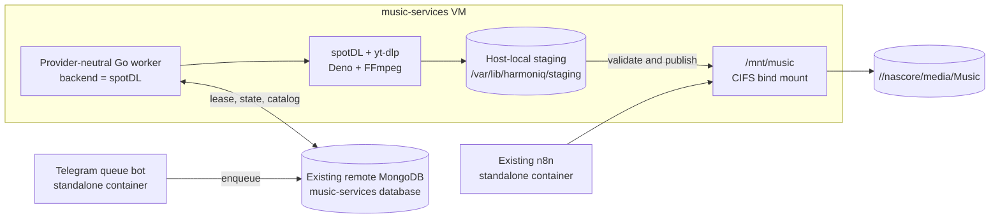

# `music-services` production state after the spotDL-primary cutover

This document records the Harmoniq deployment that was cut over and validated
on `music-services` on 2026-08-03. It is an as-deployed evidence record, not a
generic installation guide. Secret values are intentionally omitted.

For the pre-cutover VM snapshot and the migration design, see
[`vm-infrastructure-current-state.md`](./vm-infrastructure-current-state.md)
and
[`vm-infrastructure-spotdl-migration.md`](./vm-infrastructure-spotdl-migration.md).

## Outcome

The hourly root-cron downloader has been replaced by one continuously running,
worker-only Compose service. The provider-neutral Go coordinator is now
responsible for queue leases, acquisition, validation, publication, and the
`music-files` catalog update. Its active acquisition backend remains
**spotDL**.

spotDL is no longer invoked by a host-side cron job. The Go worker, spotDL,
yt-dlp, Deno, FFmpeg, and ffprobe all run in the same container. The host
provides the read-only configuration, private writable runtime paths, local
staging, and the NAS bind mount.

The existing Telegram queue bot and n8n deployment were not folded into this
Compose project. They remain independent workloads on the same VM. The legacy
indexer and dynamic-playlist jobs remain stopped, as do all three legacy music
cron entries.

## Deployed artifact record

| Item | As deployed |
| --- | --- |
| Source revision | `66249d8352029c4c1f4bb8207b61950aa326d714` (`fix spotdl staging path contract`) |
| Source archive SHA-256 | `33936b1c88c40749b667447d2461af845d6995583b4ba9208c380ff24d883fbb` |
| Image tag | `harmoniq-spotdl-wapper:66249d835202-amd64` |
| Image ID | `sha256:0c50782a027f8ff2dc6935a7652340422c0b66f35d2e4a80e7683b4bc4250bea` |
| Image platform | Linux/amd64 |
| Container | `harmoniq-spotdl-wapper` |
| Compose project | `harmoniq-worker` |
| Compose manifest | `/opt/harmoniq-worker/compose.yml`, root-owned mode `0640` |
| Compose SHA-256 | `b4a9018cdcc225e81f9f2a8ce9a9de1061f8f8ace7e99d3ac1d83acd3274f31e` |
| Deployment environment | `/etc/harmoniq/deploy.env`, root-owned mode `0600` |
| Worker environment | `/etc/harmoniq/spotdl-wapper.env`, root-owned mode `0600` |
| spotDL configuration | `/etc/harmoniq/spotdl/config.json`, mode `0440`, owner `root:1000` |
| spotDL config SHA-256 | `b8444907da7e0c48602a1fb6632454777bc59b12a69b64a378a6d1dfd3292bb5` |
| Runtime identity | UID/GID `1000:1000` |
| Restart/logging | `unless-stopped`; journald tag `harmoniq-spotdl-wapper` |
| Container hardening | All Linux capabilities dropped; `no-new-privileges`; no published ports |

The image was smoke-checked as the runtime UID and contains spotDL `4.5.2`,
yt-dlp `2026.07.04`, Deno `2.9.4`, and FFmpeg `5.1.9`. `pull_policy: never`
prevents an implicit registry pull, but the tag is still a mutable local name;
operators must compare the image ID above before every recreate or rollback.

## Production topology

The worker-only Compose manifest deliberately has no MongoDB, Telegram bot,
indexer, dynamic-playlist service, or published listener. It reuses the
existing remote MongoDB and preserves `/mnt/music/...` as the catalog path
namespace.

## Storage and runtime layout

### NAS mount and identity

The host mount is `//nascore/media/Music` at `/mnt/music`, using CIFS with
UID/GID `1000:1000`, `file_mode=0640`, `dir_mode=0750`, and the hardening
options `nosuid,nodev,noexec`. The worker therefore runs as `1000:1000`; it
does not use the image's original UID/GID 10001.

The container receives `/mnt/music` at the identical path with write access.
`/mnt/music/.harmoniq-nas-sentinel` exists only on the mounted share, is mode
`0640` with mapped owner `1000:1000`, and is over-mounted read-only inside the
container. The container entrypoint refuses to start the worker unless that
sentinel is readable. Host-side start procedures must also prove with
`findmnt` that `/mnt/music` is the expected CIFS source; the sentinel is not a
replacement for that check.

Published media is normalized to mode `0640`, matching the mount policy and
the existing consumer identity.

### Local staging and persistent home

| Host path | Container use | Mode and owner |
| --- | --- | --- |
| `/var/lib/harmoniq/staging` | Acquisition attempts before validated publication | `0750`, `1000:1000` |
| `/var/lib/harmoniq/home` | Persistent `HOME`, including the Deno cache | `0750`, `1000:1000` |
| `/var/lib/harmoniq/spotdl-temp` | Writable spotDL/yt-dlp temporary state | `0750`, `1000:1000` |
| `/var/lib/harmoniq/spotdl-runtime` | Private writable provider state | `0700`, `1000:1000` |
| `/var/lib/harmoniq/spotdl-runtime/cookies.txt` | Writable runtime cookie copy | `0600`, `1000:1000` |

The staging path is host-local, not on CIFS. A successful import validates the
asset, publishes it to the NAS, journals/catalogs the result, and removes the
owned attempt directory. Cleanup recognizes both the current
`harmoniq-attempt-*` prefix and the legacy `.harmoniq-attempt-*` prefix, but it
trusts or removes a directory only when the private Harmoniq ownership marker
is also present.

### spotDL configuration split

`/etc/harmoniq/spotdl` is mounted read-only at both spotDL discovery paths:
`/home/appuser/.config/spotdl` and `/home/appuser/.spotdl`. The canonical
configuration and cookie file are mode `0440`, owned by `root:1000`.

Two narrower writable mounts overlay that read-only tree:

- `/var/lib/harmoniq/spotdl-temp` is mounted at the `temp` subdirectory in
  both discovery paths;
- `/var/lib/harmoniq/spotdl-runtime/cookies.txt` is mounted over `cookies.txt`
  in both discovery paths.

The writable cookie copy is required because yt-dlp writes its cookie store on
normal shutdown. The root-owned canonical cookie file remains unchanged and
is the source for controlled refreshes. Both copies are sensitive credentials
and must never be printed, committed, or included in ordinary diagnostics.

The effective spotDL configuration uses Deno as the JavaScript runtime and
selects the YouTube `web_music` player client. A metadata-only yt-dlp probe
with that exact configuration succeeded before the final canary.

## Database safety evidence

The production MongoDB remains at the existing Tailscale-reachable endpoint
`100.111.149.52:27017`; no local database container was introduced. Before the
first production claim, the final archive was written to:

`/var/backups/harmoniq/20260802-c9d3b33/final/music-services.final.mongo8.archive.gz`

Its SHA-256 is
`17c2d31c8a934caf8f18f6ef9eab22f6c76bd79a8f3b37278d132acdde5424df`.
The archive is root-owned mode `0600`. A restore into a fresh MongoDB 8
instance completed successfully and reproduced 7 collections with 19,985
documents. The adjacent `restore-verified` marker and dump logs record that
check.

The cutover created and verified these application indexes:

- `queue_claim_eligibility_v2` on the queue claim fields;
- `music_spotify_id_unique_sparse`, with `unique: true` and `sparse: true`;
- `music_checksum_sparse`, with `sparse: true`.

The playlist tree was separately captured in
`cutover/playlists.before.tar.gz`. These backups are on the VM's own root
filesystem; they are rollback evidence, not an off-host disaster-recovery
copy.

## Canary and acceptance evidence

Starting the Telegram bot and submitting one track increased the queue from
141 to 142 documents, proving that the existing producer still enqueues into
the database consumed by the new worker.

The bounded canary completed with the following final state:

| Field | Result |
| --- | --- |
| Request ID | `b172653c-ea77-48d6-8d77-c04a356f112a` |
| Spotify/source ID | `03jnWnj2qOrYofsyCTuHC6` |
| Request state | `completed`; `active=false` |
| Backend/history | `spotdl`; `retry_count=1` |
| Catalog ID | `e9c11aaf-2227-4b58-9af3-21fe45035de5` |
| Published path | `/mnt/music/Job-downloaded/benny the butcher, freddie gibbs - one way flight (feat. freddie gibbs).m4a` |
| SHA-256 | `13efc86a52a68db647b722deccafc03b4a5b9c5f58ffc93e450ddd93a9eed912` |
| File | 11,235,648 bytes; mode `0640`; owner `1000:1000` |
| Media probe | AAC, 44.1 kHz, stereo, 198.996 seconds; duration delta `0` |

Post-import validation found 19,766 total `music-files` documents and exactly
one row for the canary Spotify ID. The catalog path and checksum match the
published file, and `/var/lib/harmoniq/staging` was empty after cleanup.

### Cutover defects found and corrected

The canary exposed four independent integration assumptions. Each was fixed
before accepting the deployment:

1. A wholly read-only spotDL configuration tree prevented creation of provider
   temporary state. Narrow writable `temp` overlays were added.
2. The selected yt-dlp path required a supported JavaScript runtime. The
   copied production config was changed from Node to the Deno runtime already
   included in the image.
3. The previous YouTube client selection and a read-only cookie file prevented
   reliable provider completion. The config now uses `web_music`, and a
   private writable runtime cookie copy is over-mounted without changing the
   canonical file.
4. The worker created `.harmoniq-attempt-*` directories, but spotDL sanitized
   the dot-prefixed path component and wrote into a sibling
   `harmoniq-attempt-*` directory. The provider then correctly rejected the
   unexpected location as a contract failure. Revision `66249d8` uses the
   non-dot-prefixed owned-attempt format, rejects dot-prefixed spotDL output
   roots, and retains marker-gated compatibility cleanup for legacy attempts.

Unmarked diagnostic residue was not adopted as a successful import. Before the
corrected canary, it was moved intact to
`/var/backups/harmoniq/66249d835202/worker-upgrade/staging-residue.before` as
incident evidence. Production staging was then empty and remained empty after
the corrected image completed the canary.

## Service state at handoff

| Workload | State | Notes |
| --- | --- | --- |
| `harmoniq-spotdl-wapper` | Running; restart count 0 | spotDL backend; worker-only Compose; no container healthcheck |
| `telegram-queue-bot` | Running; restart count 0 | Standalone legacy container; process works and can enqueue |
| `n8n-music-services` | Running | Existing deployment, unchanged by this cutover |
| Legacy `/root/spotdl-wapper` cron | Disabled | Entry retained with `HARMONIQ_CUTOVER_DISABLED` for rollback |
| Legacy `/root/music-indexer` cron | Disabled; process stopped | New worker catalogs its own imports synchronously |
| Legacy `/root/dynamic-playlists` cron | Disabled; process stopped | Not replaced by the worker deployment |

The Telegram container still reports Docker health `unhealthy`. Its inherited
healthcheck calls a `/health` endpoint with `wget` and exits unsuccessfully;
that signal is not evidence that the bot process is stopped. The process was
running and the canary enqueue proved its main path, but the healthcheck must
be corrected in a separate source-mapped bot deployment.

## Difference from the original VM deployment

| Concern | Original deployment | As deployed after cutover |
| --- | --- | --- |
| Downloader lifecycle | Root-owned binary started hourly by cron with `flock` and timeout | Long-running container with queue leases, heartbeat, retries, and graceful shutdown |
| spotDL execution | Host-side legacy wrapper and host configuration | spotDL runs inside the versioned worker image |
| Provenance | Copied binary with no source-to-artifact mapping | Recorded source revision, source archive hash, image tag, and image ID |
| Import/catalog | Download followed by a separate ten-minute indexer | Worker validates, publishes, and upserts the catalog in one coordinated flow |
| Staging | Legacy/provider-managed behavior | Private host-local owned-attempt directories with marker-gated cleanup |
| Runtime user | Root | UID/GID `1000:1000`, aligned with the CIFS mapping |
| NAS safety | Direct host use of `/mnt/music` | Identical namespace plus CIFS mode hardening, mount preflight, and read-only in-container sentinel |
| Queue producer | Standalone Telegram container | Unchanged standalone Telegram container |
| MongoDB | Existing remote database | Same database and collections, now with explicit claim/catalog indexes |
| Provider choice | spotDL coupled to the legacy wrapper | Provider-neutral coordinator, with spotDL still selected as primary |

The direct yt-dlp provider is present in the image but is not enabled in
production. A later switch should preserve this Compose, MongoDB, staging, and
NAS boundary. It still requires an isolated or exclusive canary, or explicit
deterministic routing; unassigned requests must not be left for spotDL and
yt-dlp workers to race for concurrently.

## Rollback record and order

The root-only pre-cutover backup set is
`/var/backups/harmoniq/20260802-c9d3b33`. It contains:

- `legacy/`: the three original binaries, wrapper scripts, spotDL config and
  cookies, the original fstab and crontab, and `SHA256SUMS`;
- `cutover/`: the original and cutover crontabs, pre-remount fstab, container
  state, playlist archive, and each superseded Compose/spotDL config revision;
- `final/`: the verified MongoDB archive, logs, and restore marker.

The corrected-worker upgrade evidence is under
`/var/backups/harmoniq/66249d835202/worker-upgrade`, including the preserved
`staging-residue.before` directory from the failed path-contract attempts.
Keep both backup roots available through the rollback and incident-review
window.

Rollback must preserve the single-writer invariant:

1. Pause the Telegram producer if queue-state intervention is required.
2. Stop `harmoniq-spotdl-wapper` and prove that it no longer owns a live lease.
3. Restore the required legacy files and the saved crontab/fstab from the
   backup set, verify the NAS mount, and only then re-enable the selected
   legacy jobs. Never run the legacy downloader or indexer alongside the new
   worker.
4. Do not clear `backend`, lease, retry, result, or catalog fields in bulk.
   Requeue only explicitly reviewed request IDs after the previous worker is
   stopped.
5. Restore the MongoDB archive only for a confirmed data-recovery event, with
   every producer and writer stopped. An ordinary application rollback does
   not require reverting the completed canary or its valid catalog row.

The earlier `c9d3b33` container candidate is not a known-good provider
rollback: it contains the diagnosed dot-prefixed staging-path defect. The
original root artifacts are the full pre-cutover fallback; the current
`66249d8` image is the accepted container baseline.

## Remaining risks and required follow-up

- Rotate the MongoDB, SMB, and Spotify credentials used during the cutover.
  Update all active consumers together, verify them, and then invalidate the
  old values. Do not copy values into tickets, chat, logs, or this repository.
- Refresh/rotate the provider cookie file through a controlled secret-handling
  procedure. Preserve mode `0600` on the runtime copy and `0440` on the
  canonical copy. Treat the root-only legacy backup containing cookies as
  sensitive for its entire retention period.
- Replace the mutable `latest` images for the Telegram bot and n8n with
  source-mapped immutable artifacts. Fix the Telegram health endpoint/check
  so Docker health reflects the process's real readiness.
- Add an off-host, restore-tested backup. The verified MongoDB archive and
  playlist tarball currently share the VM's failure domain.
- Add monitoring for queue age, `needs_review`, retries, lease expiry, worker
  restart count, staging growth, NAS availability, and disk consumption. The
  sentinel is a startup guard, not continuous CIFS-loss detection.
- Decide how files written directly by n8n or other NAS clients enter the
  catalog while the legacy indexer is disabled. Do not silently re-enable the
  indexer beside the worker.
- Keep spotDL as the only production acquisition claimant until deterministic
  backend routing or an exclusive yt-dlp cutover procedure is in place.
