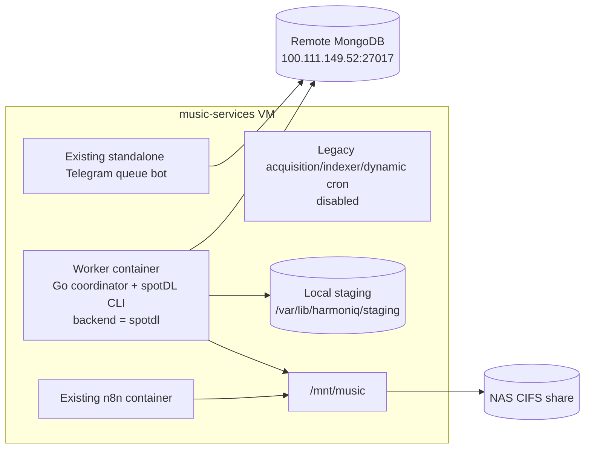

# `music-services` VM migration to the provider-neutral worker

This runbook compares the `music-services` VM observed on 2026-08-01 with the
provider-neutral `spotdl-wapper` implementation in this repository and defines
a safe migration path. The procedural sections remain the reusable deployment
and rollback plan. Stage A was performed on 2026-08-03; its authoritative
post-cutover topology and evidence are recorded in
[`vm-infrastructure-production-state.md`](./vm-infrastructure-production-state.md).

Read these companion documents first:

- [`vm-infrastructure-current-state.md`](./vm-infrastructure-current-state.md)
  is the immutable read-only, pre-migration VM snapshot;
- [`vm-infrastructure-production-state.md`](./vm-infrastructure-production-state.md)
  is the current post-cutover production record;
- [`spotdl-wapper-current-state.md`](./spotdl-wapper-current-state.md) describes
  the implemented worker lifecycle and storage contracts;
- [`spotdl-wapper-migration.md`](./spotdl-wapper-migration.md) records the
  provider-replacement decision and application-level rollout constraints;
- [`configuration.md`](./configuration.md) is the environment-variable
  reference.

## Executive decision

Treat the change as two migrations with separate rollback boundaries:

1. Replace the hourly, root-owned legacy binary with the current long-running
   coordinator, initially using `ACQUISITION_BACKEND=spotdl`.
2. Validate and later promote the direct `yt-dlp` provider only after routing,
   review, audit, and matching-quality gates are satisfied.

The first migration is deployed. Production keeps spotDL primary inside the
new worker container. The second migration has not begun: direct `yt-dlp`
remains an opt-in implementation and Stages B through D are future work.

Do **not** deploy the repository's root `docker-compose.yml` unchanged on this
VM. The first production change should be a worker-only deployment that keeps:

- the existing remote MongoDB and, after direct verification, its live
  database/collection contract;
- the existing `/mnt/music` path inside and outside the container;
- the current queue producer; retain the dynamic-playlist deployment assets but
  leave that workload disabled until it is migrated as a separate change;
- spotDL as the initial acquisition provider and rollback path.

The direct `yt-dlp` backend is implemented, but the current system cannot route
a percentage cohort deterministically. Running spotDL and yt-dlp workers at the
same time causes each unassigned request to go to whichever worker claims it
first. Production yt-dlp rollout is therefore blocked on controlled routing or
must be an exclusive, maintenance-window switch.

## Current deployment versus migration target

| Concern | Observed deployment | First migration target |
| --- | --- | --- |
| Worker lifecycle | `/root/spotdl-wapper` starts hourly from root cron, guarded by `flock` and a 55-minute timeout | One source-mapped container runs continuously, renews queue leases, and handles graceful shutdown |
| Acquisition | Source-unmapped legacy binary invokes spotDL; exact matching/output behavior was not inspected | Go coordinator owns queue state, validation, import, and cataloging; spotDL is only the initial provider |
| Queue coordination | Live schema was not queried; legacy flags and one-shot behavior are inferred from the deployment and older contracts | Atomic claim, random claim fence, heartbeat lease, explicit states, scheduled retry, and backend affinity |
| Cataloging | `/root/music-indexer` scans every ten minutes and currently logs walk errors | Worker validates, publishes, journals, and upserts `music-files` synchronously |
| MongoDB | Remote endpoint at `100.111.149.52:27017`; no local MongoDB container; exact live database/collection use was not queried | Verify and preserve the same remote database and collections for the first migration |
| Library | CIFS share at `/mnt/music`; downloads under `/mnt/music/Job-downloaded` | Bind `/mnt/music` to the identical container path and preserve the catalog namespace |
| Staging | Legacy spotDL behavior | Dedicated host-local staging at `/var/lib/harmoniq/staging` |
| Runtime identity | Root-owned binary running as root | Container explicitly runs as UID/GID 1000 to match the CIFS mapping; the image default remains 10001 |
| Configuration | Secrets embedded in root wrapper assignments; config under `/root/.spotdl` | Root-only environment files, read-only canonical spotDL config, and narrowly scoped writable temp/runtime-cookie overlays |
| Artifact provenance | Copied February 2026 binary with a recorded hash but no source revision | Source-mapped Linux/amd64 image identified by exact image ID and source-archive checksum; use a registry digest when available |
| Logging | Cron mail, host output, and application Loki | Docker/journald initially; application Loki only after container-network validation |
| Health | Cron invocation proves only that the command started | Container state, logs, MongoDB state transitions, and artifact checks; no worker readiness endpoint exists yet |

The new worker can claim legacy active documents without `state` as pending.
That proves only enqueue-format compatibility; it does not prove that the
source-unmapped, unhealthy queue bot will avoid later writes that conflict with
leases or display every new state correctly. Keep general access paused until
its full MongoDB behavior is verified during the canary.

### Stage A as deployed

The deployed worker-only project is `/opt/harmoniq-worker/compose.yml`. It uses
source revision `66249d8352029c4c1f4bb8207b61950aa326d714` and image
`harmoniq-spotdl-wapper:66249d835202-amd64` with image ID
`sha256:0c50782a027f8ff2dc6935a7652340422c0b66f35d2e4a80e7683b4bc4250bea`.
The transferred source archive SHA-256 is
`33936b1c88c40749b667447d2461af845d6995583b4ba9208c380ff24d883fbb`.

The worker, Telegram queue bot, and n8n are running. The old acquisition
worker, indexer, and dynamic-playlist cron entries remain present for rollback
but have zero enabled entries; the indexer and dynamic-playlists processes are
stopped. The worker-only Compose project does not start MongoDB, a queue bot,
an indexer, or dynamic playlists and publishes no network port. spotDL is not
invoked on the host: the Go coordinator starts the pinned spotDL CLI as a child
process inside the worker container.

## Why the repository Compose file is not the VM manifest

Starting the root `docker-compose.yml` on `music-services` would combine
several unrelated and unsafe changes:

- it would start a new local `mongo:7` and point the worker at that empty
  database instead of the live remote queue and catalog;
- it would publish MongoDB on host port `27017` while the VM input policy is
  currently `accept`;
- it would try to publish a new album queue on port `8080`, which is already
  owned by `telegram-queue-bot`;
- it would mount the library at `/music`, while host consumers are configured
  for `/mnt/music/...` and the live catalog path prefixes remain to be queried;
- it would change dynamic-playlist execution from the observed ten-minute cron
  cadence to a one-hour default loop;
- it would leave the old cron binaries active unless they were separately
  disabled.

Even `docker compose up spotdl-wapper` is unsuitable because that service
declares the local MongoDB as a dependency and receives a hard-coded
`mongo:27017` URI. Use the worker-only production manifest in this document.

## Target topology for the first migration



The legacy indexer is intentionally absent. It must be paused while the new
worker owns imports. If n8n or another process adds files directly to the NAS,
that external-ingest requirement needs a separate reconciler or owned-file
import path before the indexer can be retired permanently.

## Non-negotiable migration invariants

Do not proceed unless the change preserves all of these invariants:

1. Direct inspection confirms the production database name and collection
   names used by the live queue, worker, indexer, and dynamic-playlist clients.
   The target `DATABASE_URL` points to the same remote MongoDB. This runbook's
   examples use `DATABASE_NAME=music-services` because that value was observed
   for the indexer and dynamic-playlist wrappers; verify it for the queue and
   worker before treating it as authoritative.
2. The container uses `MUSIC_LIBRARY_PATH=/mnt/music`; do not introduce a
   second `/music/...` catalog namespace.
3. Exactly one acquisition implementation can claim unassigned production
   requests during each rollout stage.
4. The old cron worker is inactive before the new worker starts. The old binary
   does not participate in the new lease protocol.
5. The legacy indexer does not concurrently catalog worker-produced files.
6. The new worker publishes no network port.
7. MongoDB and NAS recovery are confirmed before the first production claim.
8. The deployed image is identified by digest and can be restored with its
   exact configuration.
9. Backend and provenance fields are preserved during rollback; operators must
   never clear `backend` blindly.
10. The worker refuses to start unless `/mnt/music` is the expected CIFS mount
    and a NAS-resident sentinel is readable; Docker must never bind the empty
    local mountpoint after a failed boot mount.

## Blocking decisions and preflight gates

### CIFS identity and filesystem semantics

The observed CIFS mount maps files to UID/GID 1000, while the worker image runs
as UID/GID 10001. Root's ability to write through the legacy binary does not
prove that the container can write.

Stage A resolved this mismatch by explicitly running the production container
as `1000:1000`. The image still defaults to `10001:10001`; every production
probe must therefore apply the Compose identity instead of relying on the image
default. Host-local staging and writable spotDL runtime paths are owned by
`1000:1000`, while canonical configuration remains root-owned and read-only.

Choose and document one of these approaches:

- grant UID/GID 10001 the required NAS directories through a verified NAS ACL
  or CIFS mapping;
- provide a separate mount of the same share with the required numeric
  identity, while preserving the `/mnt/music` path in the container;
- change and review the image so its runtime UID/GID is configurable and build
  it to match the established mount identity.

Do not make the entire share world-writable. A Compose `user: 1000:1000`
override is not automatically safe: the image's home, Deno cache, and spotDL
paths were created for UID 10001 and must also be made consistent.

The deployed manifest makes the required spotDL state explicit: it overlays a
private writable temp directory and runtime cookie file at both of spotDL's
supported config locations. It does not make the canonical config directory or
cookie source writable. Deno and the selected `web_music` client were verified
through the production container before the accepted canary.

The real CIFS mount must support every operation used by the importer:

- create, write, `chmod 0640`, and file sync;
- hard-link publication within the final directory;
- atomic rename/replacement;
- directory sync;
- removal of failed temporary files.

A failure in any one of these operations is a cutover blocker.
The final importer also sets mode `0640`; verify the resulting NAS owner/group
mapping lets every playback, n8n, and playlist consumer read the file. A
successful container write alone is insufficient.

### CIFS mount availability

`/mnt/music` is also a local mountpoint on the VM. If CIFS is absent during
boot and Docker binds that directory anyway, the worker could fill the VM's
32-GiB root filesystem with files that look as if they belong on the NAS.

While the share is positively identified as the expected CIFS mount, create a
small NAS-resident sentinel and never create the same file on the underlying
local mountpoint:

```bash
findmnt --noheadings --target /mnt/music --types cifs
test ! -e /mnt/music/.harmoniq-nas-sentinel
printf 'nascore Music share\n' > /mnt/music/.harmoniq-nas-sentinel
chmod 0444 /mnt/music/.harmoniq-nas-sentinel
```

Record the observed `findmnt` source and mount options. Every manual or
automated start must check both `findmnt` and the sentinel before Compose is
invoked. The manifest also checks the sentinel inside the container, which
protects Docker restart-policy starts that bypass the host preflight.

For Stage A, `/mnt/music` was remounted from `//nascore/media/Music` with
UID/GID `1000`, `file_mode=0640`, `dir_mode=0750`, and
`nosuid,nodev,noexec`. The sentinel is NAS-resident and also over-mounted
read-only at the same path inside the container, so the worker can test it but
cannot modify it through the otherwise writable library bind.

Arrange the VM's eventual startup unit after `remote-fs.target`, Docker,
Tailscale, and the `/mnt/music` mount. Test the missing-mount boot path in a
non-production or controlled maintenance scenario: the worker must exit before
opening MongoDB or creating media. Monitor the mount during runtime and stop
the worker after CIFS I/O or mount-loss alarms; a startup check is not runtime
health monitoring.

### Persisted path namespace

`music-files.path`, request recovery journals, and M3U entries contain paths
visible to the worker. Existing host services use `/mnt/music/...`. Mounting
the NAS as `/music` would make old catalog entries appear outside the worker's
library root and could cause reacquisition, duplicates, or invalid playlists.

Inventory catalog path prefixes before deployment. The count of `/music/...`
rows should remain zero unless a separate, explicit path migration is planned.

### Output layout and format

The current wrapper supplies a directory-like destination,
`/mnt/music/Job-downloaded/`. The new importer requires an explicit filename
template. A directory alone would be interpreted as a filename and is not a
valid translation.

Inspect a representative sample of existing files and the current spotDL
configuration without copying secrets into the change record. Confirm:

- audio format and codec expectations;
- filename and subdirectory layout;
- tag and cover-art expectations;
- what n8n, players, playlists, and other consumers assume.

The example in this document uses:

```text
/mnt/music/Job-downloaded/{artists} - {title}.{output-ext}
```

It is a proposed template, not an observed current naming contract.

### Legacy indexer and external imports

The new worker catalogs only assets it acquires and imports. It does not scan
arbitrary files placed on the NAS. Before pausing `/root/music-indexer`, find
every external writer, including n8n, and decide whether it still requires a
scanner.

Do not run the legacy indexer against new worker imports until its behavior is
source-mapped and proved to preserve Spotify identity, provenance, checksum,
and the existing document ID. Concurrent plain inserts or identity-less
updates can create logical duplicates.

### Playlist ownership

The new worker materializes one-off `playlist-requests`; the legacy
`dynamic-playlists` binary manages another playlist flow. Under the example
target configuration, both would write beneath
`/mnt/music/Job-downloaded/Playlists`; only the legacy dynamic path was directly
observed on the VM.

Before resuming dynamic playlists, inventory generated filenames and prove
that the two writers have disjoint ownership or move them to explicitly
separate directories. Also add a lock or timeout to the legacy ten-minute cron
job as a separate hardening change; the observed job can overlap today.

### Backup and restore ownership

The VM audit found no guest-managed workload backups. Proxmox backups, remote
MongoDB backups, and NAS snapshots were unknown. Assign an owner and perform a
restore drill for:

- the `music-services` MongoDB database;
- the NAS paths that contain downloads and playlists;
- the root crontab, wrappers, binaries, and spotDL configuration;
- the worker-only deployment manifest, environment checksum, and image digest.

Do not call a backup verified solely because its creation command exited zero.

## Configuration translation

| Legacy setting or behavior | Initial worker setting | Migration note |
| --- | --- | --- |
| Remote MongoDB URI in wrapper | `DATABASE_URL=<same URI>` | Do not use the repository Compose URI or start local MongoDB |
| Database `music-services` observed for indexer/dynamic wrappers | `DATABASE_NAME=music-services` after live verification | Preserve the queue/catalog collections and additive schema |
| Library `/mnt/music/` | `MUSIC_LIBRARY_PATH=/mnt/music` | The host and container path must be identical |
| Destination `/mnt/music/Job-downloaded/` | `MEDIA_OUTPUT_TEMPLATE=/mnt/music/Job-downloaded/{artists} - {title}.{output-ext}` | Confirm the filename template against current files before use |
| Dynamic output `/mnt/music/Job-downloaded/Playlists/` | `PLAYLISTS_OUTPUT_PATH=/mnt/music/Job-downloaded/Playlists` | Confirm one-off and dynamic ownership |
| No explicit private staging | `ACQUISITION_STAGING_PATH=/var/lib/harmoniq/staging` | Host-local bind mount, owned by the runtime UID |
| spotDL only | `ACQUISITION_BACKEND=spotdl` | First stage and rollback-compatible baseline |
| Current media format from the copied config and accepted canary | `ACQUISITION_AUDIO_FORMAT=m4a` | The accepted canary produced and validated AAC audio in an M4A container |
| Hourly cron plus 55-minute whole-process timeout | Long-running service; `WORKER_POLL_INTERVAL=1m`, initially `ACQUISITION_COMMAND_TIMEOUT=55m` | The new timeout is per downloader/FFmpeg/FFprobe command, so the semantics are not identical; measure and tighten it after the compatibility soak |
| `SLEEP_IN_MINUTES=0` | `SLEEP_IN_MINUTES=0` | Preserve current no-delay behavior between requests |
| `/root/.spotdl/config.json` | Root-owned read-only canonical copy mounted at both supported container paths | `SPOTDL_USE_CONFIG=true` is a boolean, not a file path; writable temp and runtime-cookie overlays are separate |
| `BLOB_ENABLED=false` | Remove | The new worker does not consume this setting |
| Loki enabled at `dashboard:3100` | Start with `LOKI_ENABLED=false`, then enable after container DNS/routing validation | Docker already logs to journald; avoid losing or duplicating logs |
| Root execution | Production UID/GID 1000; image default 10001 | The Compose override, staging ownership, config readability, temp directory, cookie file, and NAS mapping must be tested together |

The new worker also requires explicit lease, retry, matching, FFmpeg, and
Spotify settings. Do not depend on `.env.example` defaults in production.
Verify the Spotify client credentials from the container network before the
canary, and supply a user `SPOTIFY_REFRESH_TOKEN` when current Development Mode
playlist reads require it.

## Release preparation

The current repository working tree is not a release artifact. Select a clean,
reviewed commit, run the full test/build checks, and build an immutable
Linux/amd64 image. Building off-VM is preferred because the guest has a small
root filesystem and almost fully occupied swap.

```bash
git status --porcelain
git rev-parse HEAD
make test-core
make build-core-linux
```

The first command must return no output. Record the commit and build logs.

Example image build and publication:

```bash
docker buildx build \
  --platform linux/amd64 \
  --file spotdl-wapper/Dockerfile \
  --tag registry.example/harmoniq/spotdl-wapper:<git-sha> \
  --push \
  .
```

Resolve and record the registry digest. Deploy the
`registry.example/harmoniq/spotdl-wapper@sha256:<digest>` reference, not the
mutable tag. If no registry is available, transfer a `docker save` archive over
the existing administrative channel, verify its SHA-256 on the VM, and record
the loaded image ID.

Smoke-check the exact image before it can access production data:

```bash
docker run --rm \
  --entrypoint sh \
  registry.example/harmoniq/spotdl-wapper@sha256:<digest> \
  -ec 'id; spotdl --version; yt-dlp --version; deno --version; ffmpeg -version; ffprobe -version'
```

The image-default runtime identity is UID/GID 10001. The production Compose
manifest overrides it to UID/GID 1000, so repeat the smoke check with
`--user 1000:1000` and the production mounts before granting data access.
Record both identities and the tool versions in the change evidence.

Prepare dedicated host paths without changing the NAS mount itself:

```bash
install -d -o 0 -g 0 -m 0700 /etc/harmoniq
install -d -o 0 -g 1000 -m 0750 /etc/harmoniq/spotdl
install -d -o 0 -g 0 -m 0750 /opt/harmoniq-worker
install -d -o 1000 -g 1000 -m 0750 /var/lib/harmoniq/staging
install -d -o 1000 -g 1000 -m 0750 /var/lib/harmoniq/spotdl-temp
install -d -o 1000 -g 1000 -m 0700 /var/lib/harmoniq/spotdl-runtime
install -d -o 0 -g 0 -m 0700 /var/backups/harmoniq
```

Numeric group `1000` matches the established CIFS identity used by the
production Compose override. Copy the existing spotDL configuration without
printing it, then make it group-readable by only the container identity:

```bash
test ! -e /etc/harmoniq/spotdl/config.json
install -o 0 -g 1000 -m 0440 \
  /root/.spotdl/config.json \
  /etc/harmoniq/spotdl/config.json
```

If the inspected configuration uses a cookie file, retain a root-owned
canonical copy and give the downloader a distinct private runtime copy. yt-dlp
may update the cookie jar when it exits, so mounting the canonical file itself
writable would defeat the immutable-input boundary:

```bash
install -o 0 -g 1000 -m 0440 \
  /root/.spotdl/cookies.txt \
  /etc/harmoniq/spotdl/cookies.txt
install -o 1000 -g 1000 -m 0600 \
  /etc/harmoniq/spotdl/cookies.txt \
  /var/lib/harmoniq/spotdl-runtime/cookies.txt
```

The production config copy translates the legacy JavaScript runtime to Deno
and selects the `web_music` YouTube player client. The rollback source under
`/root/.spotdl` remains unchanged. Treat both cookie copies as credentials;
never print, checksum into public logs, or commit their contents.

## Worker-only production manifest

Store a production-specific manifest at
`/opt/harmoniq-worker/compose.yml`. This example intentionally declares no
MongoDB, queue, dynamic-playlist service, or published port:

```yaml
name: harmoniq-worker

services:
  spotdl-wapper:
    image: ${HARMONIQ_WORKER_IMAGE:?set the exact image reference}
    pull_policy: never
    container_name: harmoniq-spotdl-wapper
    user: "1000:1000"
    restart: unless-stopped
    entrypoint: ["/bin/sh", "-ec"]
    command:
      - 'test -r /mnt/music/.harmoniq-nas-sentinel && exec ./spotdl-wapper'
    env_file:
      - /etc/harmoniq/spotdl-wapper.env
    volumes:
      - type: bind
        source: /mnt/music
        target: /mnt/music
      - type: bind
        source: /mnt/music/.harmoniq-nas-sentinel
        target: /mnt/music/.harmoniq-nas-sentinel
        read_only: true
      - type: bind
        source: /var/lib/harmoniq/staging
        target: /var/lib/harmoniq/staging
      - type: bind
        source: /etc/harmoniq/spotdl
        target: /home/appuser/.config/spotdl
        read_only: true
      - type: bind
        source: /var/lib/harmoniq/spotdl-temp
        target: /home/appuser/.config/spotdl/temp
      - type: bind
        source: /var/lib/harmoniq/spotdl-runtime/cookies.txt
        target: /home/appuser/.config/spotdl/cookies.txt
      - type: bind
        source: /etc/harmoniq/spotdl
        target: /home/appuser/.spotdl
        read_only: true
      - type: bind
        source: /var/lib/harmoniq/spotdl-temp
        target: /home/appuser/.spotdl/temp
      - type: bind
        source: /var/lib/harmoniq/spotdl-runtime/cookies.txt
        target: /home/appuser/.spotdl/cookies.txt
    stop_grace_period: 30s
    security_opt:
      - no-new-privileges:true
    cap_drop:
      - ALL
    logging:
      driver: journald
      options:
        tag: harmoniq-spotdl-wapper
```

Put only the image reference in `/etc/harmoniq/deploy.env`:

```dotenv
HARMONIQ_WORKER_IMAGE=harmoniq-spotdl-wapper:66249d835202-amd64
```

The VM-local tag is accepted only together with `pull_policy: never`, the
recorded source archive checksum, and verification that it resolves to image ID
`sha256:0c50782a027f8ff2dc6935a7652340422c0b66f35d2e4a80e7683b4bc4250bea`.
A registry digest remains preferable for a future release.

Create `/etc/harmoniq/spotdl-wapper.env` as root-owned mode `0600`. The initial
compatibility configuration is:

```dotenv
DATABASE_URL=<existing remote MongoDB URI>
# Use this value only after direct live verification; replace it if different.
DATABASE_NAME=music-services

SPOTIFY_CLIENT_ID=<secret>
SPOTIFY_CLIENT_SECRET=<secret>
SPOTIFY_REFRESH_TOKEN=

ACQUISITION_BACKEND=spotdl
ACQUISITION_AUDIO_FORMAT=m4a
ACQUISITION_COMMAND_TIMEOUT=55m
ACQUISITION_STAGING_PATH=/var/lib/harmoniq/staging

MUSIC_LIBRARY_PATH=/mnt/music
MEDIA_OUTPUT_TEMPLATE="/mnt/music/Job-downloaded/{artists} - {title}.{output-ext}"
PLAYLISTS_OUTPUT_PATH=/mnt/music/Job-downloaded/Playlists

WORKER_ID=music-services-spotdl-01
WORKER_POLL_INTERVAL=1m
WORKER_LEASE_DURATION=45m
WORKER_RETRY_DELAY=15m
WORKER_MAX_ATTEMPTS=3
SLEEP_IN_MINUTES=0

SPOTDL_BINARY=/usr/local/bin/spotdl
SPOTDL_USE_CONFIG=true
YTDLP_BINARY=/usr/local/bin/yt-dlp
YTDLP_SEARCH_LIMIT=10
YTDLP_MINIMUM_SCORE=0.72
FFMPEG_BINARY=ffmpeg
FFPROBE_BINARY=ffprobe
MEDIA_DURATION_TOLERANCE=15s

LOKI_ENABLED=false
LOKI_URL=
```

The initial `55m` command timeout avoids shortening any single legacy
operation without evidence about current runtimes. Unlike the old wrapper's
55-minute cap on the entire process, it applies independently to each command,
so a multi-track request can run longer. Measure real command duration and
tighten this value deliberately after the spotDL compatibility soak.

Create a separate root-owned `/etc/harmoniq/mongo-admin.env` for probes and
backups. Do not pass Spotify or Loki secrets into database-tool containers:

```dotenv
DATABASE_URL=<existing remote MongoDB URI>
# Use this value only after direct live verification; replace it if different.
DATABASE_NAME=music-services
```

Protect all deployment inputs after writing them:

```bash
chown 0:0 /opt/harmoniq-worker/compose.yml
chmod 0640 /opt/harmoniq-worker/compose.yml
chown 0:0 /etc/harmoniq/deploy.env /etc/harmoniq/spotdl-wapper.env /etc/harmoniq/mongo-admin.env
chmod 0600 /etc/harmoniq/deploy.env /etc/harmoniq/spotdl-wapper.env /etc/harmoniq/mongo-admin.env
```

URL-encode credentials inside `DATABASE_URL`. Do not print the rendered
configuration or put secret values in shell history. Validate without output:

```bash
findmnt --noheadings --target /mnt/music --types cifs
test -r /mnt/music/.harmoniq-nas-sentinel
docker compose \
  --env-file /etc/harmoniq/deploy.env \
  --file /opt/harmoniq-worker/compose.yml \
  config --quiet
```

Retain the original `/root/.spotdl/config.json` and its checksum unchanged
through the legacy rollback window. Verify that the mounted copy is readable,
but not writable, by production UID 1000. Review it for host-only absolute paths,
cookies, proxy settings, output overrides, and cache locations; translate or
mount each required dependency deliberately rather than assuming `/root/...`
exists in the container.

Verify the read-only boundaries and narrowly writable runtime paths as the
actual production user:

```bash
docker run --rm \
  --user 1000:1000 \
  --mount type=bind,source=/mnt/music,target=/mnt/music \
  --mount type=bind,source=/mnt/music/.harmoniq-nas-sentinel,target=/mnt/music/.harmoniq-nas-sentinel,readonly \
  --mount type=bind,source=/etc/harmoniq/spotdl,target=/home/appuser/.config/spotdl,readonly \
  --mount type=bind,source=/var/lib/harmoniq/spotdl-temp,target=/home/appuser/.config/spotdl/temp \
  --mount type=bind,source=/var/lib/harmoniq/spotdl-runtime/cookies.txt,target=/home/appuser/.config/spotdl/cookies.txt \
  --entrypoint sh \
  harmoniq-spotdl-wapper:66249d835202-amd64 \
  -ec 'test -r /mnt/music/.harmoniq-nas-sentinel; test ! -w /mnt/music/.harmoniq-nas-sentinel; test -r /home/appuser/.config/spotdl/config.json; test ! -w /home/appuser/.config/spotdl/config.json; test -w /home/appuser/.config/spotdl/temp; test -w /home/appuser/.config/spotdl/cookies.txt'
```

Before starting the worker, verify that a container on the VM can reach the
remote MongoDB through Docker bridge and Tailscale routing. This command keeps
the URI out of the command line:

```bash
docker run --rm \
  --env-file /etc/harmoniq/mongo-admin.env \
  mongo:7 \
  sh -ec 'mongosh "$DATABASE_URL" --quiet --eval "db.runCommand({ping: 1}).ok"'
```

The expected result is `1`. A successful host connection is not an adequate
substitute because the worker uses a Docker network namespace.

From the same Docker networking context, verify DNS and TLS egress to Spotify
and every source/proxy required by the inspected spotDL configuration without
downloading media. In particular, a proxy or Tor setting that uses host
`127.0.0.1` will point at the container itself and needs an explicit, reviewed
container-to-host route. Record only endpoints and outcomes, never cookies,
tokens, or proxy credentials.

## Filesystem preflight

Run this authorized write test with the exact production image and bind mount.
It deliberately exercises the operations required by the importer and removes
only its reserved test directory. Replace `change-id` with the approved change
identifier so concurrent or abandoned preflights cannot collide:

```bash
docker run --rm \
  --user 1000:1000 \
  --mount type=bind,source=/mnt/music,target=/mnt/music \
  --security-opt no-new-privileges \
  --cap-drop ALL \
  --entrypoint sh \
  harmoniq-spotdl-wapper:66249d835202-amd64 \
  -ec '
    d=/mnt/music/Job-downloaded/.harmoniq-preflight-1000-change-id
    test ! -e "$d"
    mkdir "$d"
    cleanup() {
      rm -f "$d/source" "$d/published" "$d/current"
      rmdir "$d" 2>/dev/null || true
    }
    trap cleanup EXIT
    printf test > "$d/source"
    chmod 0640 "$d/source"
    python -c "import os; p=\"$d/source\"; f=os.open(p, os.O_RDONLY); os.fsync(f); os.close(f)"
    test "$(stat -c %a "$d/source")" = 640
    stat -c "uid=%u gid=%g mode=%a path=%n" "$d/source"
    ln "$d/source" "$d/published"
    printf old > "$d/current"
    mv -f "$d/published" "$d/current"
    test -s "$d/current"
    python -c "import os; p=\"$d\"; f=os.open(p, os.O_RDONLY | os.O_DIRECTORY); os.fsync(f); os.close(f)"
    cleanup
    trap - EXIT
  '
```

Repeat an equivalent create/write/delete test for:

- `/mnt/music/Job-downloaded/Playlists`;
- the local `/var/lib/harmoniq/staging` bind mount;
- a representative playback client reading a resulting mode-`0640` file.

Do not proceed if hard links, directory sync, permissions, or cleanup fail.

## Database preflight

Use a MongoDB account permitted to read the queue/catalog and create indexes.
The worker attempts index creation at startup, but failures are best-effort and
do not prevent startup.

First, securely verify the live `DATABASE_NAME` used by the current worker,
queue container, indexer, and dynamic-playlist wrapper, and list the live
collection names. Do not print the MongoDB URI or container environment into
the change log. The examples below use `music-services`,
`download-queue-requests`, `music-files`, and `playlist-requests`; change them
if direct inspection proves that production differs.

Lease timestamps also depend on host time. Compare the VM clock with the
remote MongoDB `hello.localTime`, record the skew, and correct timekeeping
before cutover if it exceeds the operator's lease-safety threshold. A five-
second target is reasonable for this deployment; the guest reported a
synchronized clock during the audit, but its guest NTP service was inactive.

### Inventory queue state

Run this against the `music-services` database:

```javascript
db.getCollection("download-queue-requests").aggregate([
  {
    $group: {
      _id: {
        state: {
          $cond: [
            {$eq: [{$ifNull: ["$state", ""]}, ""]},
            "<legacy/pending>",
            "$state"
          ]
        },
        backend: {
          $cond: [
            {$eq: [{$ifNull: ["$backend", ""]}, ""]},
            "<unassigned>",
            "$backend"
          ]
        },
        active: "$active",
        errored: "$errored"
      },
      count: {$sum: 1}
    }
  },
  {$sort: {"_id.state": 1, "_id.backend": 1}}
])

db.getCollection("download-queue-requests").find(
  {active: true},
  {
    spotify_url: 1,
    state: 1,
    backend: 1,
    worker_id: 1,
    claim_id: 1,
    lease_expires_at: 1,
    next_attempt_at: 1,
    retry_count: 1
  }
)
```

The new worker immediately drains every eligible request. At first launch, the
eligible set must be empty or contain only the exact bounded canary request IDs.
Reconcile stale legacy `active=true` rows separately; a broadly “approved”
backlog is not a one-track canary.

The same worker also processes active one-off playlist requests after downloads
are drained. Such a request can enqueue child downloads and write an M3U even
when the download queue was empty. Inventory it explicitly:

```javascript
db.getCollection("playlist-requests").find(
  {active: true},
  {
    spotify_url: 1,
    no_pull: 1,
    errored: 1,
    retry_count: 1,
    created_at: 1,
    updated_at: 1
  }
)
```

The first launch must have no active playlist request except an explicitly
bounded canary whose possible child requests and output path are approved.

### Audit catalog identities

The new sparse unique Spotify-ID index includes any document where the field
exists, including legacy empty or null values. Find duplicates before startup:

```javascript
db.getCollection("music-files").aggregate([
  {$match: {spotify_id: {$exists: true}}},
  {
    $group: {
      _id: "$spotify_id",
      count: {$sum: 1},
      documents: {$push: "$_id"}
    }
  },
  {$match: {count: {$gt: 1}}}
])
```

Do not automatically delete duplicate records. Reconcile their media paths,
Spotify identities, references, and consumer impact under a separate reviewed
procedure. Duplicate checksums are legitimate and must not be deduplicated.

Also inventory invalid-but-unique values; a single null, empty, or non-string
value may still enter a sparse index and cause later surprises:

```javascript
db.getCollection("music-files").countDocuments(
  {spotify_id: {$exists: true, $in: [null, ""]}}
)
db.getCollection("music-files").aggregate([
  {$match: {spotify_id: {$exists: true}}},
  {$group: {_id: {$type: "$spotify_id"}, count: {$sum: 1}}}
])
```

Check the persisted path namespaces:

```javascript
db.getCollection("music-files").countDocuments({path: /^\/mnt\/music(?:\/|$)/})
db.getCollection("music-files").countDocuments({path: /^\/music(?:\/|$)/})
db.getCollection("music-files").find(
  {path: {$not: /^\/mnt\/music(?:\/|$)/}},
  {_id: 1, path: 1, spotify_id: 1}
).limit(100)
```

The last query also surfaces missing, non-string, relative, and other absolute
paths. Investigate every such row before cutover; do not infer path consistency
from the VM mount configuration.

### Review and create the migration indexes

After the database backup is complete and legacy catalog writers are paused,
create the indexes as an explicit, reviewed maintenance operation rather than
letting worker startup create them unexpectedly:

```javascript
db.getCollection("download-queue-requests").createIndex(
  {
    active: 1,
    backend: 1,
    state: 1,
    next_attempt_at: 1,
    lease_expires_at: 1,
    errored: 1,
    created_at: 1
  },
  {name: "queue_claim_eligibility_v2"}
)

db.getCollection("music-files").createIndex(
  {spotify_id: 1},
  {name: "music_spotify_id_unique_sparse", unique: true, sparse: true}
)

db.getCollection("music-files").createIndex(
  {checksum: 1},
  {name: "music_checksum_sparse", sparse: true}
)
```

Stop if any command fails. Do not remove or merge catalog records merely to
force index creation. Record the complete `getIndexes()` output and verify, not
only the names:

- the exact queue key order shown above;
- `music_spotify_id_unique_sparse` has both `unique: true` and `sparse: true`;
- `music_checksum_sparse` is sparse and is not unique.

Inspect startup logs as well. A running worker does not prove that its
best-effort index check succeeded or matched the expected definitions.

## Cutover checkpoint

Use a maintenance window. Pause every Harmoniq writer long enough to capture a
consistent recovery point:

1. Record the queue bot image ID, restart policy, redacted configuration
   metadata, and a proved restart procedure before relying on it for canary
   intake.
2. Stop `telegram-queue-bot` so no new requests are submitted.
3. Identify and coordinate n8n workflows, other NAS clients, and any other
   MongoDB writers. Pause them or explicitly document that the recovery point
   is not cross-system consistent.
4. Save root's current crontab to a mode-`0600` backup and prepare an edited
   copy.
5. Comment out only the `spotdl-wapper`, `music-indexer`, and
   `dynamic-playlists` entries; do not delete their wrappers or binaries.
6. Wait for all three processes and the two lock-protected jobs to finish.
7. Investigate the indexer's repeated `error walking` messages. Reconcile the
   files under `/mnt/music/Job-downloaded` against `music-files`, and account
   for every legacy active request and partial file. A final cron invocation or
   `Scan complete` line is not proof of a complete catalog.
8. Capture the exact bounded canary download IDs, active playlist inventory,
   catalog inventories, and collection counts.
9. Create a remote MongoDB backup and take or confirm a NAS snapshot.
10. Restore the MongoDB backup into a separate MongoDB instance—not another
    database on the production server—and compare collections, indexes,
    counts, and sampled document integrity.
11. Create and verify the reviewed migration indexes described above.
12. Record the old binary/wrapper hashes already listed in the current-state
   document and the new image/configuration identifiers.

Save and edit the crontab recoverably. Review a diff that changes exactly the
three intended entries before installing the edited copy; avoid an interactive
edit of the live crontab:

```bash
umask 077
crontab -l > /root/crontab.before-harmoniq-worker-migration
cp /root/crontab.before-harmoniq-worker-migration /root/crontab.harmoniq-worker-cutover
${EDITOR:-vi} /root/crontab.harmoniq-worker-cutover
diff --unified /root/crontab.before-harmoniq-worker-migration /root/crontab.harmoniq-worker-cutover
crontab /root/crontab.harmoniq-worker-cutover
crontab -l > /root/crontab.installed-harmoniq-worker-cutover
sha256sum /root/crontab.before-harmoniq-worker-migration /root/crontab.installed-harmoniq-worker-cutover
```

If unrelated or credential-bearing cron lines exist, review the diff only in
the protected administrative session and do not paste it into the change log.
Rollback restores the exact saved file with
`crontab /root/crontab.before-harmoniq-worker-migration`.

Confirm no old process remains:

```bash
pgrep -af '/root/spotdl-wapper|/root/music-indexer|/root/dynamic-playlists'
flock -n /tmp/spotdl.lock -c true
flock -n /tmp/indexer.lock -c true
```

The first command should find no target process, and both `flock` checks should
exit zero after the cron entries are disabled.

An example database dump, using secrets only through a root-owned environment
file, is shown below. First create the change-specific directory, estimate the
database dump size, and verify free bytes/inodes. The VM root filesystem had
only about 13 GiB free during the audit; stream directly to approved backup
storage if the local safety margin is insufficient.

```bash
install -d -o 0 -g 0 -m 0700 /var/backups/harmoniq/<change-id>
df -h /var/backups/harmoniq/<change-id>
df -i /var/backups/harmoniq/<change-id>
docker run --rm \
  --env-file /etc/harmoniq/mongo-admin.env \
  --mount type=bind,source=/var/backups/harmoniq/<change-id>,target=/backup \
  mongo:7 \
  sh -ec 'mongodump --uri="$DATABASE_URL" --db="$DATABASE_NAME" --archive=/backup/music-services.archive.gz --gzip'
```

Use a recorded database-tools image version/digest compatible with the live
MongoDB server. Copy or replicate the backup outside this guest and complete
the isolated restore drill before continuing.

Stage A execution produced a final MongoDB archive and restored it into an
isolated target: seven collections and 19,985 documents were restored. The
legacy wrappers, crontab, production manifest, configuration, and playlist
state also have protected change-specific backups under
`/var/backups/harmoniq`. No full NAS snapshot was available. That is a recorded
recovery gap, not a completed NAS-restore gate; imported media must not be
represented as covered by the MongoDB archive alone.

## Stage A: deploy the new coordinator with spotDL — deployed

This is the first production baseline. Do not set `ACQUISITION_BACKEND=yt-dlp`
yet. “Compatibility” refers to the provider boundary, not binary equivalence:
the live spotDL/tool versions were not captured, while the new image also adds
per-track orchestration, FFmpeg tagging/validation, a new filename template,
atomic publication, and synchronous cataloging. Compare actual matching and
output as part of acceptance.

The accepted deployment uses source revision
`66249d8352029c4c1f4bb8207b61950aa326d714` and the image recorded above. Its
first bounded track canary produced this evidence:

| Evidence | Result |
| --- | --- |
| Queue request | `b172653c-ea77-48d6-8d77-c04a356f112a` |
| Final lifecycle | `completed`, `active=false`, `backend=spotdl`, `retry_count=1` |
| Spotify/source ID | `03jnWnj2qOrYofsyCTuHC6` |
| Catalog ID | `e9c11aaf-2227-4b58-9af3-21fe45035de5` |
| Catalog cardinality | 19,766 documents total; exactly one row for the Spotify ID |
| Published path | `/mnt/music/Job-downloaded/benny the butcher, freddie gibbs - one way flight (feat. freddie gibbs).m4a` |
| Published asset | 11,235,648 bytes; mode `0640`; UID/GID `1000:1000` |
| Media probe | AAC, 44.1 kHz, stereo, duration 198.996 seconds |
| SHA-256 | `13efc86a52a68db647b722deccafc03b4a5b9c5f58ffc93e450ddd93a9eed912` |
| Staging after import | Empty |

The retry count was deliberately preserved rather than rewriting the canary's
failure history. Before acceptance, the canary exposed several integration
problems that made the queue appear not to advance:

1. The all-read-only spotDL config mount prevented spotDL from creating its
   temporary state. The manifest now provides a dedicated writable temp bind.
2. The copied legacy config selected Node even though the pinned image carries
   Deno. The production copy selects Deno; the rollback source is unchanged.
3. yt-dlp writes its cookie jar on close and failed against the canonical
   read-only file. It now receives a private mode-`0600` runtime copy, while
   the canonical cookie remains read-only, and uses the verified `web_music`
   player client.
4. spotDL 4.5.2 sanitizes every dot-prefixed path component. It changed a
   marked `.harmoniq-attempt-*` path into an unmarked sibling, downloaded a
   valid asset there, and left the wrapper checking the original path. The
   current `harmoniq-attempt-*` prefix and non-dot production staging root
   avoid that rewrite. The importer still accepts legacy marked attempts, but
   never adopts or deletes an unmarked sanitized sibling automatically.

Exact unmarked diagnostic/canary residues were inventoried and moved intact to
`/var/backups/harmoniq/66249d835202/worker-upgrade/staging-residue.before`
before the corrected canary was replayed. They were not adopted as a valid
import. Production staging was empty for the replay and remained empty after
completion. The generic repository default was also changed away from
`/music/.staging`, and the spotDL provider now rejects any dot-prefixed staging
component before running the tool.

1. Keep all producers paused, both queues free of eligible work, and the old
   worker/indexer cron entries disabled.
2. Start only the worker-only Compose project against the empty eligible set.
   Confirm mount guard, database connection, provider selection, worker ID,
   complete index definitions, and absence of secret values in logs; then stop
   it gracefully.
3. Establish a deterministic operator-only intake mechanism: a separately
   configured canary producer, or a temporary queue-bot whitelist whose exact
   configuration and restart behavior have been proved. If general users
   cannot be excluded, stop here.
4. With every acquisition worker stopped, submit exactly one authorized track,
   stop the canary producer again, and query MongoDB for the exact request ID.
   Confirm it is the only eligible download and that no active playlist can
   enqueue child work.
5. Start the worker and validate that track end-to-end.
6. Repeat the producer-stop, exact-ID inventory, worker-start, and validation
   sequence for a representative album and then a playlist.
7. Resume normal queue access only after acceptance checks pass and after
   proving the legacy bot does not mutate lifecycle fields after enqueue.
8. Resume dynamic playlists only after path/output ownership is verified and
   overlap is prevented with a lock/timeout or a replacement scheduler.
9. Keep the legacy indexer disabled until an external-import decision is
   implemented.

Start and observe the worker:

```bash
docker compose \
  --env-file /etc/harmoniq/deploy.env \
  --file /opt/harmoniq-worker/compose.yml \
  up --detach spotdl-wapper

docker inspect \
  --format '{{.State.Status}} restart-count={{.RestartCount}}' \
  harmoniq-spotdl-wapper

docker logs --since 15m harmoniq-spotdl-wapper
```

There is no readiness endpoint. A running container is necessary but not
sufficient.

After acceptance, both `harmoniq-spotdl-wapper` and the existing Telegram bot
were running with restart count zero, and n8n remained running. Docker still
labels the queue bot unhealthy because its pre-existing HTTP healthcheck is
broken; the `./main` process is running and its successful insertion of the
canary proves the enqueue path independently. The legacy indexer and dynamic
playlists remain stopped and their cron entries remain disabled.

For every canary, verify:

- the request reaches `completed` and `backend=spotdl`;
- lease ownership and state transitions behave as expected while active;
- `retry_count`, `last_error`, and `result` are internally consistent;
- `result.catalog_id` refers to the stored `music-files` document;
- catalog provenance includes Spotify identity, `source_provider=spotdl`,
  checksum, format, and a `/mnt/music/...` path;
- the file is non-empty, playable, correctly tagged, mode `0640`, and its
  SHA-256 matches the stored checksum;
- no duplicate catalog row or second physical file appears;
- a normal graceful restart preserves completed work and releases any current
  claim correctly;
- one-off M3U replacement produces valid, host-readable entries;
- the legacy queue bot does not write progress/lifecycle fields after enqueue,
  and it and the dynamic-playlist consumer tolerate the additive schema and
  stored paths;
- source selection, filenames, tags, and downstream readability are compared
  with representative legacy artifacts;
- logs are visible through the chosen route and contain no secrets.

A graceful stop normally cancels commands and releases a claim. A forced kill,
blocked CIFS operation, or MongoDB outage can leave work unavailable until its
45-minute lease expires. Verify that failure mode only in the isolated
DB/library environment, monitor it in production, and never clear lease fields
to make work immediately claimable.

## Stage B: soak and operational hardening

Advance based on evidence, not only elapsed time. The compatibility baseline
must cover representative tracks, multi-track requests, playlist creation,
retry, clean restart, and at least one catalog-finalization recovery exercise
in an isolated or deliberately controlled canary environment. Do not induce a
production MongoDB outage merely to satisfy this gate.

Required gates before direct-provider testing are:

- no unexplained restarts or live-worker lease expirations;
- no repeated recovery-journal catalog failures or orphan published files;
- no new duplicate Spotify identities or mixed path prefixes;
- acceptable queue age, retry rate, and storage growth;
- stable CIFS behavior and sufficient VM/NAS capacity;
- a defined local-staging free-space threshold and an alert/stop procedure;
  stale marked attempts are swept, but staging has no hard quota and shares the
  VM's small root filesystem;
- measured worker/FFmpeg peak memory, CPU, process count, and image/log growth;
  introduce conservative limits only from canary evidence so the 4-GiB guest
  is protected without arbitrarily killing valid conversions;
- scheduled MongoDB and NAS protection with a demonstrated restore;
- recorded image digest, source commit, manifest checksum, and redacted
  configuration checksum;
- alerts or an operator query for stuck leases, `retry_wait`, `needs_review`,
  and unfinished jobs pinned to a backend with no worker.

Validate `dashboard:3100` DNS and routing from the worker container before
enabling application Loki. Decide whether application Loki or
journald/Promtail is authoritative so logs are neither lost nor duplicated.

## Stage C: validate direct yt-dlp acquisition

The current first-claim affinity is not a cohort router. If spotDL and yt-dlp
workers run together, either can claim a new unassigned request. The following
application capabilities remain prerequisites for a normal percentage canary:

- producer-controlled backend assignment or a routing service;
- non-mutating shadow resolution;
- bounded candidate evidence and rejection reasons;
- operator review, approve, cancel, resume, and audited reroute operations;
- matching-quality metrics and agreed wrong-match/review thresholds.

The safest present-day test is an isolated canary database and library:

1. Provision a schema-compatible isolated database. Copy only explicitly
   approved canary requests and any required catalog fixtures; do not clone the
   production backlog into an active canary database.
2. Bind a separate authorized test-library directory at `/mnt/music` in the
   canary container so stored paths remain representative without touching the
   production library.
3. Run exactly one canary worker with `ACQUISITION_BACKEND=yt-dlp`.
4. Measure correct-recording, wrong-match, review, retry, duration-mismatch,
   latency, tag, path, and provenance results.
5. Destroy or archive the isolated environment according to the content and
   audit policy; do not merge test queue state into production.

Create isolated requests through a producer pointed at the canary database or
a reviewed fixture that starts them as unassigned `pending` work. Do not copy
production claim IDs, leases, backend assignments, or retry history and do not
edit production documents to create the test.

Give this environment its own Compose project, container name, environment
file, database name, `WORKER_ID`, staging directory, and NAS test subtree. For
example, use `harmoniq-ytdlp-canary`,
`music-services-ytdlp-canary-01`, and
`/var/lib/harmoniq/ytdlp-canary-staging`; do not reuse the production
`harmoniq-spotdl-wapper` container or worker identity. Bind the authorized NAS
test subtree at `/mnt/music` inside the canary container and give it its own
mount sentinel so path and CIFS behavior remain representative.

An exclusive production maintenance-window canary is possible only when all
other acquisition workers and producers are stopped and the only unassigned
requests are the explicitly approved canaries. It is not a percentage rollout
and it requires an operator plan for any request ending in `needs_review`.

Use direct acquisition only for content the deployment is authorized to
download. Switching software does not change content rights or platform terms.

## Stage D: make yt-dlp primary

Proceed only after the Stage C gates and product thresholds are approved. The
two possible rollout modes are operationally different.

### Routed cohort

After producer-controlled routing exists, every new request must be assigned a
backend before workers can claim it. Then:

1. Pause producers.
2. Prove there are no unassigned requests and configure the explicit yt-dlp
   cohort.
3. Start distinct spotDL and yt-dlp workers with unique identities and verify
   their image/configuration records.
4. Resume producers and alert immediately if any request is created without a
   backend assignment.
5. Increase the routed cohort only after its matching and review gates pass.
6. Keep spotDL available for its pinned unfinished work and for routed rollback
   traffic during the defined window.

### Exclusive all-new-work switch without routing

Without routing, there is no cohort and a spotDL worker cannot be reserved for
only pinned work because its claim filter also accepts unassigned requests. An
approved switch is therefore 100% of new work:

1. Pause producers and all acquisition workers.
2. Prove there are no unassigned requests.
3. Drain, cancel, or otherwise account for every spotDL-pinned unfinished
   request while producers remain paused.
4. Stop the spotDL worker completely.
5. Start only the yt-dlp worker and verify its backend, worker ID, and image
   digest.
6. Resume producers, explicitly accepting that all new work is now assigned to
   yt-dlp.
7. Keep the pinned spotDL image and config for a rollback that begins by
   pausing producers again.

Do not enable automatic provider fallback. A low-confidence result should
remain `needs_review`, not silently acquire from a different backend.

Retire spotDL only after no active, retry, or review request remains assigned
to it and the rollback window has expired.

## Rollback

### New coordinator to legacy cron

Before the first production claim, stop the container and verify that it did
not claim queue or playlist work. This is still not a zero-mutation rollback:
the reviewed indexes were already added to production, and startup may sweep
old ownership-marked files from the configured staging directory. Leave the
indexes in place unless a separate compatibility review justifies removing
them.

For later coordinator upgrades, prefer the previous validated provider-neutral
image and its exact `ACQUISITION_BACKEND=spotdl` configuration. Stop the current
service, restore the recorded image digest and root-owned configuration, and
force a recreate:

```bash
docker compose \
  --env-file /etc/harmoniq/deploy.env \
  --file /opt/harmoniq-worker/compose.yml \
  stop --timeout 40 spotdl-wapper

# Restore the previously recorded deploy.env, worker env, manifest, and config.

docker compose \
  --env-file /etc/harmoniq/deploy.env \
  --file /opt/harmoniq-worker/compose.yml \
  up --detach --force-recreate spotdl-wapper
```

The first migration has no previous provider-neutral production image. Its
choices are stop-and-fix-forward or the explicitly higher-risk legacy-cron
rollback. The February 2026 binary is not mapped to source, and its behavior
with every additive state is unproven even though the new code dual-writes
legacy flags.

If restoring the legacy binary becomes unavoidable:

1. Pause producers and dynamic playlist writers.
2. Stop the container gracefully.
3. Inventory every claim, lease, retry, review, imported journal, and backend
   assignment.
4. Verify there is no active lease and decide how every unfinished request
   will be handled.
5. Preserve all imported files and catalog provenance.
6. Re-enable the exact legacy worker schedule and validate one bounded request.
7. Re-enable the indexer only after the new importer is stopped, duplicate risk
   is reviewed, and its walk errors are resolved; verify a complete catalog
   pass.
8. Re-enable dynamic playlists only after the catalog is current and the job
   has a lock/timeout, or leave them paused as an explicitly degraded rollback.
9. Resume the queue producer last.

Do not restore an old database snapshot casually after successful imports. It
would discard queue/catalog history while leaving newer files on the NAS. A
paired MongoDB/NAS restore is a disaster-recovery decision with an explicit
data-loss boundary, not a routine application rollback.

### yt-dlp to spotDL

1. Pause producers.
2. Stop yt-dlp workers gracefully.
3. Preserve MongoDB, imported files, backend fields, and provenance.
4. Before starting anything, inventory every unassigned request and every
   unfinished `backend=yt-dlp` request. Approve, cancel, or fence each
   unassigned request for the rollback; do not let an unknown backlog race the
   provider transition.
5. Start the pinned spotDL coordinator image. It will claim only approved
   unassigned and spotDL-pinned work.
6. Let an exclusive yt-dlp worker finish yt-dlp-pinned requests, or cancel and
   resubmit them while only spotDL can claim the new work. If an yt-dlp worker
   is temporarily restarted, there must be no unassigned work unless routing
   has explicitly assigned it.

Never clear or overwrite `backend` directly. A spotDL worker correctly cannot
claim an already pinned yt-dlp request. Already imported yt-dlp artifacts stay
valid catalog entries with yt-dlp provenance and must not be relabeled or
deleted automatically.

## Post-migration work

- Keep legacy cron entries commented and binaries intact through the rollback
  window; archive their hashes and remove them only after formal acceptance.
- Rotate the MongoDB, SMB, and Spotify credentials after moving them out of
  legacy wrappers, and refresh the sensitive downloader cookie jar through a
  controlled procedure. Do not copy secret values into the change record.
- Decide how n8n and other external files enter the catalog without the legacy
  indexer.
- Add worker readiness, metrics, queue-age alerts, provider error rates, and
  recovery-journal alerts.
- Add candidate evidence, review/resume, controlled routing, and audited
  reroute before a normal yt-dlp cohort rollout.
- Reconcile the remaining publish-before-journal orphan boundary.
- Upgrade the unhealthy, source-unmapped queue bot as a separate deployment.
- Migrate dynamic playlists separately, preserve `/mnt/music` paths, and
  prevent overlap. The repository's loop sleeps 600 seconds *after* each run,
  so it provides a non-overlapping minimum interval of runtime plus ten
  minutes; use a locked scheduler instead if wall-clock ten-minute starts must
  be preserved.
- Retain the remote MongoDB until a separately backed-up and restore-tested
  database migration is approved.
- Define bounded retention for journald, the legacy indexer log, and root mail.

## Verification status after Stage A

The 2026-08-01 audit deliberately avoided active workload probes. Stage A
subsequently verified that:

- Docker bridge traffic can reach `100.111.149.52:27017` through the VM's
  Tailscale routing;
- Docker bridge DNS/TLS can reach Spotify and the source/proxy endpoints
  required by the inspected spotDL configuration;
- MongoDB credentials allow the required collection and index operations;
- CIFS supports the importer's permissions, hard links, replacement, and sync
  behavior for UID/GID 1000;
- current catalog rows use the `/mnt/music/...` namespace consistently;
- M4A and the deployed output template produce a playable, cataloged mode-0640
  artifact;
- the existing queue bot can enqueue a legacy-shaped request and does not
  prevent the worker from completing it;
- the reviewed image-transfer path produces the recorded source checksum and
  image ID.

The following remain unresolved or only partially verified:

- the MongoDB archive restored successfully, but no full NAS snapshot or NAS
  restore drill was available;
- one successful queue-bot canary does not prove every additive lifecycle
  state is rendered or left untouched correctly;
- external NAS writers are not yet fully inventoried and no replacement
  cataloging path has been implemented;
- the legacy and one-off playlist writers have not yet been proved to own
  disjoint paths, so dynamic playlists remain stopped;
- `dashboard:3100` resolves and accepts Loki traffic from the Docker bridge;
- the VM-local image is identified by an exact image ID and source archive,
  but a registry digest and off-guest retained image artifact are still
  preferable;
- readiness, queue-depth, staging-capacity, mount-loss, and provider-error
  monitoring are not implemented.

Any failed assumption returns the migration to the relevant preflight gate; it
is not a reason to improvise a production workaround during cutover.
